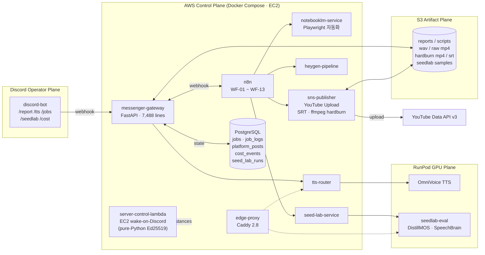
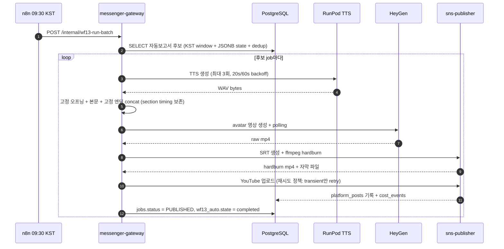

<div align="center">

# 엄형은 · Portfolio

### Content Automation Pipeline Engineer

**SKN 22기 Final · 4Team — Project HARI**

`AI Virtual Influencer · YouTube Shorts 자동 발행 시스템`

<br/>


</div>

---

## 1. 프로젝트 한 줄 요약

> **사람의 추가 검증 없이 매일 같은 시간에 YouTube Shorts 한 편이 자동 발행되도록**
> n8n · FastAPI 마이크로서비스 · PostgreSQL · S3 · RunPod GPU · Discord 운영 콘솔을 묶어
> **소스 모니터링부터 업로드, 비용 정산, 음성 품질 평가까지 한 줄로 이어지는 운영형 파이프라인**을 만들었습니다.

| 항목 | 내용 |
| :--- | :--- |
| **소속 팀** | SKN22-Final-4Team (5명) |
| **포지션** | Contents · 자동화 파이프라인 |
| **핵심 책임** | 콘텐츠 생성 → 업로드 자동화 / 비용 추적 / TTS 품질 평가 시스템 / 운영 콘솔 |
| **연관 레포** | [SKN22-Final-4Team-AI](https://github.com/DJAeun/SKN22-Final-4Team-AI) (담당), [SKN22-Final-4Team-WEB](https://github.com/DJAeun/SKN22-Final-4Team-WEB) (협업) |
| **개발 기간** | 2026-03 ~ 2026-04 |

---

## 2. 시스템 한눈에 보기



> **핵심 분리 원칙** — 스케줄과 webhook orchestration은 **n8n**, 정확한 상태 제어와 비즈니스 로직은 **FastAPI 게이트웨이**, GPU 추론은 **RunPod**. 각 평면은 책임이 다르고 실패도 따로 복구합니다.

---

## 3. 내가 한 일 (3가지 핵심)

### 🅐 WF-13 무검증 일일 자동 발행 파이프라인
> "보고서가 만들어지면, 사람 없이 TTS · HeyGen 영상 · 자막 하드번 · YouTube 업로드까지 끝낸다"

* **매일 09:30 KST** n8n schedule trigger → 게이트웨이의 `/internal/wf13-run-batch` 엔드포인트 호출 ([main.py:5671](ai-influencer/messenger-gateway/main.py:5671))
* 자동 보고서 job 후보 선별을 **단일 SQL**로 처리 — KST 일자 기준 윈도우, JSONB의 `wf13_auto.state` 진행 상태, `platform_posts.status='published'` 중복 방지를 한 번에 해결 ([main.py:1207](ai-influencer/messenger-gateway/main.py:1207))
* TTS 단계는 **3회 재시도, 20·60초 백오프**, 영상 단계는 HeyGen quota 401·429 응답을 분리해 운영자에게 Discord 알림 (`_wf13_check_heygen_quota`, `_wf13_extract_heygen_api_quota`)
* Publish 단계는 **transient(5xx, 네트워크) vs upload limit vs permanent**를 구분해서 재시도 가능한 것만 다시 시도 ([main.py:1146](ai-influencer/messenger-gateway/main.py:1146))
* 모든 시도/실패가 `script_json.wf13_auto`에 누적 기록 → **재진입 가능한 job**: 다음날 같은 단계부터 이어서 실행 가능
* 자체 예외 클래스 `Wf13PipelineError(retryable, should_stop_workflow, blocked_reason, …)`로 워크플로우 중단/재시도 신호를 구조화 ([main.py:112](ai-influencer/messenger-gateway/main.py:112))



---

### 🅑 비용을 1급 시민으로 — Cost Observability System

운영형 자동화에서는 "이 job이 얼마를 썼는가" 가 곧 의사결정의 기준입니다. 모든 LLM/TTS/ASR/HeyGen/인프라 사용을 단일 테이블로 모았습니다.

* **`cost_events` 테이블 1개로 5개 차원** 추적 — `stage` (script/tts/video) · `process` · `provider` (openai/runpod_tts/heygen/infra_fixed) · `attempt_no` · `api_key_family` ([cost_service.py](ai-influencer/messenger-gateway/services/cost_service.py))
* **idempotency_key UNIQUE 제약** — n8n이 같은 webhook을 두 번 쏴도 같은 비용이 두 번 청구되지 않음 (`ON CONFLICT (idempotency_key) DO NOTHING`, [cost_service.py:412](ai-influencer/messenger-gateway/services/cost_service.py:412))
* **`pricing_kind` 4단계 분류** — `provider_actual` (실제 청구) / `estimated` (토큰·문자수 기반) / `fixed` (인프라 고정비를 KST 일자 단위로 균등 배부) / `missing` (요금 정보 없음)
* **일일 고정비 자동 배부** — `allocate_daily_fixed_cost(target_date)`가 그날 성공한 job 수로 EC2/RunPod 인프라 비용을 N분의 1 ([cost_service.py:469](ai-influencer/messenger-gateway/services/cost_service.py:469))
* **Cost Viewer 웹 페이지** — Discord `/cost`가 **HMAC-SHA256 서명 토큰**(7일 TTL) URL을 반환, basic auth 보호 ([main.py:4025](ai-influencer/messenger-gateway/main.py:4025))
* USD↔KRW 환율(`cost_usd_krw_rate`, default 1,350)을 이벤트 시점에 함께 저장 → 환율 변동 후에도 historical KRW 보존

> **결과** — "어떤 job이 얼마를 썼는가", "실패한 job도 비용이 발생했는가", "어떤 provider가 가장 비싸졌는가" 를 SQL 한 줄로 답할 수 있는 운영 데이터 자산을 확보.

---

### 🅒 SeedLab — TTS 음성 품질 자동 평가 파이프라인
> "운영에 들어갈 TTS seed를 사람이 한 시간씩 듣고 고르는 대신, GPU 평가기에 맡긴다"

* Discord `/seedlab` 한 줄로 **여러 seed × 여러 take** 샘플을 동시에 생성 → RunPod GPU 평가기로 분산
* 평가 backbone: **DistillMOS**(자연스러움 MOS), **SpeechBrain ECAPA-TDNN**(speaker verification — 기준 하리 음성과의 유사도), **librosa/scipy**(pitch contour, spike, clipping), **OpenAI ASR**(발음 정확도) — 하이브리드 프로파일로 결합 ([requirements.txt](ai-influencer/runpod-seedlab-eval-service/requirements.txt))
* `seed_lab_runs` 테이블이 진행 상태를 진짜로 셉니다 — `progress_stage`, `generated_count`, `evaluated_count`, `failed_count`, `runpod_job_count`, `gpu_active_sample_count`, `remote_eval_failed_count` 컬럼으로 **6단계 진행률**을 Discord 메시지에 실시간 반영 ([seed-lab-service/main.py](ai-influencer/seed-lab-service/main.py))
* 결과 페이지는 **HMAC 서명 + TTL** 링크로 외부 공유 가능 (DB 자격증명 노출 없이) ([main.py:3943](ai-influencer/messenger-gateway/main.py:3943))
* **과락 조건** — 평균 점수가 좋아도 한 번의 큰 pitch jump가 있으면 자동 reject — 실제 콘텐츠에 들어가기 전 음성 사고를 차단

| 평가 계열 | 기술 | 잡아내는 문제 |
| :--- | :--- | :--- |
| 자연스러움 | DistillMOS | 전체 음성이 매끄럽게 사용 가능한지 |
| 발음 정확도 | OpenAI ASR (`gpt-4o-transcribe`) | 전사 불일치, 발음 오류 |
| 톤 유사도 | SpeechBrain ECAPA-TDNN | 기준 하리 음성과의 화자 유사성 |
| 피치 안정성 | librosa + scipy | 평균 pitch, 급격한 spike, contour 흔들림 |
| 아티팩트 감지 | numpy + soundfile | clipping, jump, harsh glitch |
| 과락 조건 | 룰 기반 | 평균이 좋아도 한 번 튀면 reject |

---

## 4. 엔지니어링 디테일 — 코드에서 의도가 보이게

### 4-1. 자막은 "타이밍"과 "표시 문장"을 분리한다

ASR이 들은 텍스트를 그대로 자막으로 쓰면 발음 오류가 그대로 노출됩니다. 그래서:

| 관심사 | 기준 | 어떻게 |
| :--- | :--- | :--- |
| **타이밍** | 최종 생성 오디오의 ASR word/segment timestamp | OpenAI `gpt-4o-transcribe` |
| **표시 문장** | curated subtitle script + 고정 오프닝/엔딩 | `subtitle_script_text` 별도 보존 |
| **정렬 실패 대응** | TTS section timing 기반 sectioned fallback | "고정 오프닝 → gap → 본문 → gap → 고정 엔딩" 시간 구조 활용 |

* 하드번 렌더링은 ffmpeg `subtitles=...:force_style=...`, **GangwonEduAll Bold** 폰트로 1080×1920 세로 영상에 직접 박음 ([main.py:90-109](ai-influencer/messenger-gateway/main.py:90))
* 캡션은 짧게 끊는다: target 10자, hard max 16자, 최소 cue 450ms, 한 문장 4 chunk 제한 ([sns-publisher-service/main.py:300-305](ai-influencer/sns-publisher-service/main.py:300))
* 캡션 ASR 비용도 별도 trace — `idempotency_key = f"youtube-asr:{ctx}:{job_id}:{subtitle_sha256}:{ts}"` ([sns-publisher-service/main.py:175](ai-influencer/sns-publisher-service/main.py:175))

### 4-2. 상태 기계는 DB 트리거로 강제한다

```sql
CREATE TRIGGER trg_job_status_log
    AFTER UPDATE ON jobs
    FOR EACH ROW
    EXECUTE FUNCTION log_job_status_change();
```
* 13개 status (`DRAFT`, `SCRIPTING`, `WAITING_APPROVAL`, `WAITING_VIDEO_APPROVAL`, `REPORT_READY`, `PUBLISHING`, `PUBLISHED`, `PARTIALLY_PUBLISHED`, `PUBLISH_FAILED`, …)를 **CHECK 제약**으로 한정 ([init.sql:27-34](ai-influencer/postgres/init.sql:27))
* 코드에서 어떤 경로로 status를 바꾸든 `job_logs`에 자동 기록 — **감사 추적이 코드 레벨이 아니라 DB 레벨에서 보장됨** ([init.sql:95-109](ai-influencer/postgres/init.sql:95))

### 4-3. 부분 실패가 전체를 멈추지 않는다

* `platform_posts (job_id, platform) UNIQUE` — YouTube가 성공하고 Instagram이 실패해도 각자 따로 재시도 가능 ([init.sql:50-64](ai-influencer/postgres/init.sql:50))
* 한쪽 실패 시 jobs.status는 `PARTIALLY_PUBLISHED`로 분기 — `FAILED`와 의미가 다름
* WF-13에서도 보고서 실패는 다음 후보로 넘어가도록 — **하루 배치가 한 job 때문에 통째로 죽지 않는다**

### 4-4. n8n과 게이트웨이의 역할 분리

| 역할 | n8n | messenger-gateway (FastAPI) |
| :--- | :--- | :--- |
| 스케줄링 | ✅ cron, hourly | ❌ |
| Webhook 수신 | ✅ external entrypoint | ✅ `/internal/*` (Internal Secret 헤더) |
| 단순 SQL UPDATE | ✅ Postgres 노드 | — |
| 비즈니스 로직 (재시도, 분기, 비용 기록) | ❌ | ✅ |
| Discord 메시지 | ❌ | ✅ DiscordAdapter |
| **외부 노출 secret** | n8n credential | ❌ (전부 env로 격리) |

> n8n에는 **로직을 안 넣는다** 가 원칙입니다. n8n JSON은 가독성이 낮고 git diff가 어렵고 테스트가 안 되기 때문. 대신 n8n은 webhook을 정확히 한 번 발화하는 역할만 — 그 위에서의 분기/재시도/예외처리는 전부 Python으로.

### 4-5. AWS 자원 절약 — Discord에서 직접 EC2 wake

* `server-control-lambda` — Discord interaction을 받아 **`pure-Python Ed25519`로 서명 검증** (외부 라이브러리 없이 표준 라이브러리만), 허용된 user id만 EC2 `StartInstances`/`StopInstances` 호출 ([lambda_function.py](ai-influencer/server-control-lambda/lambda_function.py))
* 평소엔 EC2 꺼두고, 사용 직전 Discord에서 깨운 뒤 Docker Compose가 헬스체크로 차례차례 살아남
* 결과: **idle 시간 인프라 비용 0**, 운영자가 Slack/Discord에서 절차 한 줄로 제어

### 4-6. 운영 데이터로 본 진행률

> 모든 수치는 코드/스키마에서 직접 검증 가능합니다.

| 지표 | 값 | 출처 |
| :--- | :--- | :--- |
| 마이크로서비스 컨테이너 | **11개** | [docker-compose.yml](ai-influencer/docker-compose.yml) |
| n8n 워크플로우 | **10개** (WF-01~13 중 운영 활성) | [n8n/workflows](ai-influencer/n8n/workflows) |
| Job 상태 enum | **13개** | [init.sql:27-34](ai-influencer/postgres/init.sql:27) |
| 게이트웨이 internal endpoints | **20개+** (`/internal/*`) | [main.py](ai-influencer/messenger-gateway/main.py) |
| 자동화 핵심 코드 | **~15,900 LOC** (gateway + services + publisher + seedlab + bot + notebooklm) | wc -l |
| WF-13 TTS 재시도 | 3회 / 20s · 60s backoff | `_WF13_TTS_RETRY_BACKOFF_SECONDS` |
| Cost event 차원 | 5 (stage·process·provider·attempt·api_key_family) | cost_service.py |
| Cost Viewer 토큰 TTL | 7 days, HMAC-SHA256 | main.py:4025 |

---

## 5. 워크플로우 카탈로그 — 직접 설계/구현한 자동화

| Workflow | Trigger | 핵심 로직 | 기여도 |
| :--- | :--- | :--- | :---: |
| **WF-09** YouTube Source Watcher | Schedule, 매시간 | RSS 파싱 → 24h lookback 필터 → NotebookLM 소스 자동 추가 → 자동 보고서 job 생성 | ⭐ 전담 |
| **WF-10** Daily Notebook | Schedule, 07:30 KST | 채널별 NotebookLM 노트북을 매일 갱신 (Playwright 서브프로세스 격리) | ⭐ 전담 |
| **WF-06** NotebookLM Report | Webhook | NotebookLM 가이드 → OpenAI rewrite (280-350자, 하리 말투, hook-fact-summary 구조) → REPORT_READY | ⭐ 전담 |
| **WF-11** TTS Generate | Webhook | RunPod TTS 호출 → WAV S3 업로드 → 고정 오프닝/엔딩 concat → Discord 후보 공유 | ⭐ 전담 |
| **WF-12** HeyGen Generate | Webhook | HeyGen v2 API + polling (preview-ready 분기) → WAITING_VIDEO_APPROVAL → Discord 미리보기 | ⭐ 전담 |
| **WF-08** SNS Upload | Webhook | YouTube Data API v3 OAuth refresh → ASR 캡션 → ffmpeg hardburn → platform_posts 기록 | ⭐ 전담 |
| **WF-13** Auto TTS→YouTube | Schedule, 09:30 KST | **무검증 자동 발행** — TTS · HeyGen · 자막 · 업로드 단일 트랜잭션 | ⭐ 핵심 |
| WF-01/04/05 | Webhook | 운영자 승인형 흐름 (`/report` 모달 → 확인 메시지 → 승인 핸들러) | 협업 |

---

## 6. Discord 운영 콘솔 — "관리자 페이지 없는" UX

별도의 admin 웹 페이지를 만들지 않고, **Discord 채널 자체를 협업형 production room**으로 사용했습니다.

| 명령 | 역할 | 기술 포인트 |
| :--- | :--- | :--- |
| `/report <concept>` | NotebookLM 보고서 생성 또는 기존 선택 | 모달 인터랙션, channel-scope 권한 |
| `/tts <job_id>` | TTS 후보 3개 생성 시작 | RunPod async 폴링 + WAV S3 업로드 |
| `/heygen <job_id>` | 기존 job으로 HeyGen 영상 생성 | 미리보기 후 승인 버튼 |
| `/jobs` | 채널의 최근 job 상태 조회 | Discord embed 페이지네이션 |
| `/seedlab` | 음성 평가 run 시작 → 리뷰 페이지 링크 | HMAC 서명 URL · 실시간 진행률 |
| `/cost` | 비용 뷰어 signed link 반환 | basic auth + HMAC 7-day token |

* **권한 모델** — Discord 채널 단위 ACL. 허용 채널 안에서는 팀원 누구나 명령/승인/반려를 함께 처리. 충돌 위험이 있는 짧은 세션(제목 입력 모달 등)만 시작자 기준 격리.
* 슬래시 커맨드 동기화 실패는 `on_app_command_error` 훅이 한국어/영어 이중 메시지로 응답 ([discord-bot/main.py:299](ai-influencer/discord-bot/main.py:299))

---

## 7. 협업 컨텍스트 — WEB 레포와의 관계

이번 프로젝트의 **AI 자동화 파이프라인** 부분은 제가 단독 담당했고, 사용자 대면 서비스는 [SKN22-Final-4Team-WEB](https://github.com/DJAeun/SKN22-Final-4Team-WEB) 레포에서 다른 팀원들이 Django + LangChain/LangGraph + WebSocket 기반으로 1:1 채팅·롤플레잉 RPG·이미지/영상 생성 UI를 만들었습니다.

두 레포는 **느슨하게 결합**되어 있습니다 — S3 버킷과 PostgreSQL RDS 인스턴스를 공유하고, OpenAI/HeyGen 키 같은 환경 변수를 같은 운영 환경에서 쓰지만, **서로 직접 호출하지 않습니다.** 자동화는 자동화대로, 사용자 채팅은 사용자 채팅대로 독립적으로 운영되고, 결과물(이미지/영상/오디오)만 공통 S3에서 만나도록 분리했습니다.

---

## 8. 회고 — 이 프로젝트로 증명한 것

### 🧭 시스템 분리의 감각
"하나의 Python 스크립트로 다 해결되는 영상 생성기"가 아니라, **스케줄링 / 비즈니스 로직 / GPU 추론 / 운영 콘솔**을 책임이 다른 평면으로 갈라서 만들었습니다. n8n에 로직을 안 넣고 FastAPI로 옮긴 결정, RunPod를 별도 평면으로 둔 결정 — 모두 "리뷰 가능성"과 "복구 가능성"을 위해서였습니다.

### 🔁 운영형 코드의 기준
처음 만들 때는 "잘 돌아간다" 가 기준이었지만, 매일 실행되는 시스템에서는 **"실패해도 흔적이 남는가"**, **"같은 webhook을 두 번 받아도 두 번 청구되지 않는가"**, **"중간에서 끊겨도 다음 단계부터 이어서 할 수 있는가"** 가 진짜 품질이었습니다. `idempotency_key UNIQUE`, `wf13_auto.state` 누적, status DB 트리거 — 작은 장치 하나하나가 운영 자신감을 만들었습니다.

### 💰 비용을 데이터로
"OpenAI 청구서를 보고 추측한다" 에서 "SQL로 묻는다" 로 옮겼습니다. provider별·process별·api_key_family별로 슬라이스해서 보면 어디서 돈이 새는지가 즉시 보입니다. 비용 가시성은 사이드 기능이 아니라 자동화의 일부여야 한다는 걸 배웠습니다.

### 🎙 LLM이 만든 것을 LLM이 검수한다
SeedLab은 ASR, MOS 예측기, speaker verification, 룰 기반 과락을 같은 파이프라인에 묶었습니다. **"AI가 생성한 음성을 AI가 자동으로 평가하고, 한 번 튀면 사람보다 먼저 reject한다"** — 이 구조는 다른 생성형 AI 프로덕트에도 그대로 옮길 수 있는 패턴이라고 생각합니다.

---

<div align="center">

### 📂 핵심 코드 빠르게 보기

[`ai-influencer/messenger-gateway/main.py`](ai-influencer/messenger-gateway/main.py) — 게이트웨이 본체, WF-13 오케스트레이션, ffmpeg hardburn, HMAC 서명 토큰
[`ai-influencer/messenger-gateway/services/cost_service.py`](ai-influencer/messenger-gateway/services/cost_service.py) — 비용 이벤트 idempotency · 일일 고정비 배부 · 차원별 집계
[`ai-influencer/messenger-gateway/services/job_service.py`](ai-influencer/messenger-gateway/services/job_service.py) — Job 상태 머신 · 자동 보고서 후보 쿼리 · SeedLab run 관리
[`ai-influencer/sns-publisher-service/main.py`](ai-influencer/sns-publisher-service/main.py) — YouTube 업로드 · ASR 캡션 · SRT/하드번 idempotency
[`ai-influencer/seed-lab-service/main.py`](ai-influencer/seed-lab-service/main.py) — TTS 음성 품질 평가 분산 처리
[`ai-influencer/runpod-seedlab-eval-service/main.py`](ai-influencer/runpod-seedlab-eval-service/main.py) — DistillMOS · SpeechBrain · librosa GPU 평가기
[`ai-influencer/n8n/workflows/`](ai-influencer/n8n/workflows) — WF-01~WF-13 워크플로우 JSON 10개
[`ai-influencer/postgres/init.sql`](ai-influencer/postgres/init.sql) — 스키마 · 상태 머신 트리거
[`ai-influencer/server-control-lambda/lambda_function.py`](ai-influencer/server-control-lambda/lambda_function.py) — Discord에서 EC2 깨우는 Ed25519 검증 Lambda
[`ai-influencer/docker-compose.yml`](ai-influencer/docker-compose.yml) — 11개 컨테이너 헬스체크 · 의존성 그래프

<br/>

**엄형은 · DJAeun**
[github.com/DJAeun](https://github.com/DJAeun) · djaguddms0021@gmail.com

</div>
