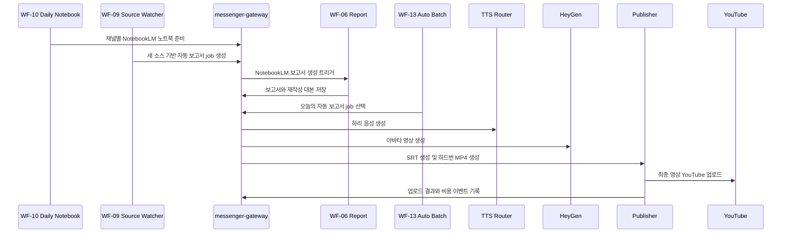
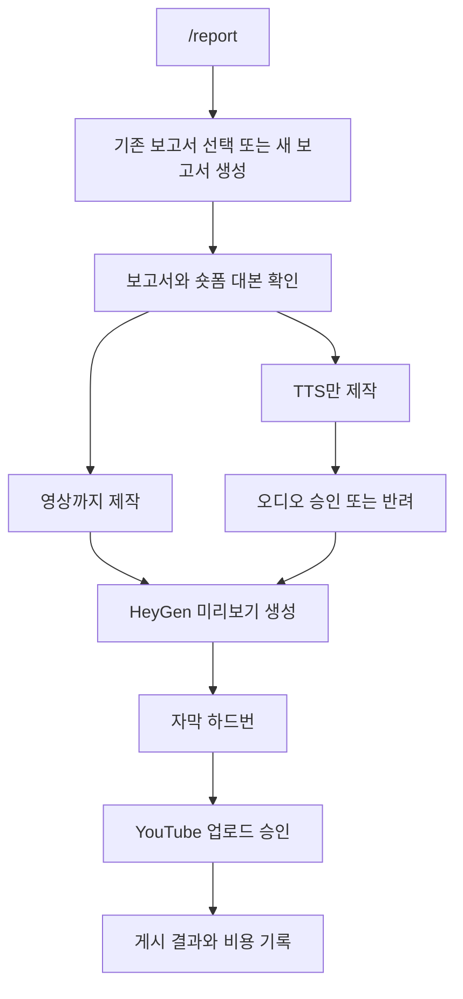
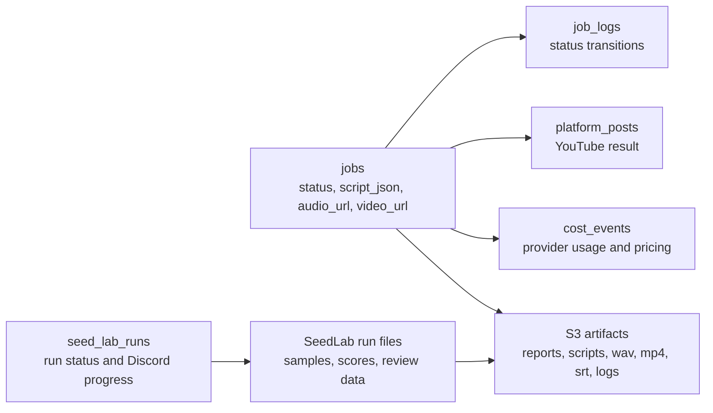

# 🎥 HARI: The AI Virtual Influencer
> **"AI 에이전트 시대, 팬 경험을 스케일링하는 새로운 테크 크리에이터"**

<p align="center">
  <a href="https://linktr.ee/chatting_hari">
    
  </a>
</p>

<p align="center">
  
</p>
<p align="center">
  <a href="https://github.com/SKNETWORKS-FAMILY-AICAMP/SKN22-Final-4Team-WEB">
    
  </a>
</p>

---

## YouTube Content Automation Pipeline

<div align="center">


</div>


## 프로젝트 개요

이 레포지토리는 YouTube 채널을 꾸준히 운영하기 위해 필요한 반복 작업을 자동화한 제작 시스템입니다.

지정한 YouTube 채널에서 최신 소스를 찾고, NotebookLM으로 보고서를 만들고, 그 보고서를 하리 캐릭터의 짧은 숏폼 대본으로 다시 씁니다. 

이후 TTS 음성을 생성하고, HeyGen 아바타 영상과 결합한 뒤, ASR 기반 타이밍으로 자막을 만들고, 최종 영상을 YouTube에 업로드합니다. 

특히 WF-13 자동 배치는 앞 단계에서 **자동 생성된 보고서 job을 사람의 추가 검증 없이 TTS 생성부터 YouTube 업로드까지 이어서 처리하도록 설계했습니다.**

단순히 영상을 하나 생성하는 스크립트가 아니라, Discord 운영 콘솔, n8n 스케줄러, FastAPI 마이크로서비스, PostgreSQL 상태 저장소, S3 아티팩트 저장소, AWS 제어 서버, RunPod GPU 추론 계층을 함께 구성한 실제 운영형 파이프라인입니다.

## 자동화 범위

| 단계 | 결과물 |
|---|---|
| 소스 모니터링 | 지정 YouTube 채널의 최신 영상 후보 |
| 리서치 생성 | NotebookLM 기반 상세 보고서 |
| 대본 재작성 | 280-350자 분량의 하리 말투 숏폼 대본 |
| 음성 생성 | 고정 오프닝/엔딩이 포함된 TTS 오디오 |
| 영상 생성 | HeyGen 기반 세로형 아바타 영상 |
| 자막 정렬 | ASR 타이밍과 curated subtitle을 결합한 SRT |
| 하드번 렌더링 | 자막이 박힌 최종 MP4 |
| YouTube 업로드 | 영상, 제목, 설명, 캡션 업로드 |
| 품질 평가 | SeedLab 기반 음성 seed 품질 평가 |
| 비용 추적 | job 단위 비용 이벤트와 사용량 기록 |

## 3. System Architecture


## 운영 환경

| 계층 | 확인된 역할 |
|---|---|
| 로컬 워크스페이스 | 서비스 코드, n8n workflow, 문서, 테스트가 있는 기준 저장소 |
| AWS EC2 | Docker Compose 기반 제어 서버, 여러 컨테이너로 분리 운영 |
| n8n | 보고서, TTS, 영상, 업로드, 소스 수집, 일일 배치 workflow 운용 |
| PostgreSQL | job 상태, 업로드 결과, 비용 이벤트, SeedLab run 상태 저장 |
| S3 | 대본, 로그, TTS wav, raw video, hardburn video, SRT, SeedLab 샘플 저장 |
| RunPod | VRAM 4GB 이상의 GPU, OmniVoice, SeedLab 평가기, 모델 캐시, startup stack 구성 |
| Discord | 팀원이 함께 조작하는 명령어, 승인 버튼, 진행률 피드백 채널 |

## 주요 사용자 흐름

### 매일 자동 발행 흐름

WF-13은 이 프로젝트의 완전 자동 발행 단계입니다. 같은 날 생성된 자동 보고서 job을 대상으로 TTS, HeyGen 영상 생성, 자막 하드번, YouTube 업로드까지 사람의 승인 버튼 없이 순차 실행합니다.



### 운영자 승인형 제작 흐름



## Discord 운영 콘솔

| 명령어 | 역할 |
|---|---|
| `/report` | NotebookLM 보고서를 생성하거나 기존 보고서를 선택하고 숏폼 대본을 준비 |
| `/tts` | 선택한 job 또는 채널의 최근 job으로 TTS 생성 |
| `/jobs` | Discord 채널 기준 최근 job 상태 조회 |
| `/seedlab` | TTS seed 평가 run 생성 및 리뷰 페이지 제공 |
| `/cost` | job별 비용을 볼 수 있는 Cost Viewer 링크 제공 |

권한 모델은 Discord 채널 중심입니다. 허용된 채널 안에서는 팀원이 함께 명령과 승인 버튼을 사용할 수 있고, 제목 입력 모달처럼 충돌 위험이 있는 짧은 세션은 시작자 기준으로 처리합니다.

## 콘텐츠 생성 로직

### 보고서에서 숏폼 대본으로

NotebookLM 보고서는 리서치를 위한 긴 문서이고, 최종 영상 대본은 별도의 rewrite 규칙으로 다시 만듭니다.

| 조건 | 구현 목표 |
|---|---|
| 길이 | 280-350자 |
| 형식 | 제목, 화자명, 지문, 메모 없는 대사 본문 |
| 말투 | 친구에게 소식을 전하는 하리식 반말 |
| 구조 | 첫 문장 hook, 중간 핵심 사실, 마지막 한 줄 정리 |
| 오디오 구조 | 오프닝/엔딩은 본문에 넣지 않고 고정 음성으로 후처리 |
| 사실성 | NotebookLM 보고서의 근거 안에서만 재작성 |

이 구조 덕분에 리서치는 자세하게 유지하면서도, 최종 영상은 Shorts에 맞는 속도와 밀도로 압축됩니다.

### 음성 조립

최종 오디오는 항상 같은 구조로 조립됩니다.

```text
고정 오프닝 -> 0.5초 gap -> 본문 TTS -> 0.5초 gap -> 고정 엔딩
```

이때 section timing을 함께 저장해, 후속 자막 생성 단계에서 오프닝, 본문, 엔딩의 시간 구조를 추적할 수 있게 했습니다.

### 자막 전략

자막은 “ASR이 들은 텍스트”를 그대로 보여주는 방식이 아닙니다.  
타이밍과 표시 문장을 분리합니다.

| 관심사 | 기준 |
|---|---|
| 타이밍 | 생성된 최종 오디오의 ASR word/segment timestamp |
| 화면 표시 문장 | curated subtitle script + 고정 오프닝/엔딩 문구 |
| 정렬 실패 대응 | selected TTS timing 기반 sectioned fallback |
| 최종 결과 | YouTube caption용 SRT와 하드번 MP4 |

이 방식은 실제 음성 타이밍을 반영하면서도, 화면에는 의도한 자막 문장이 보이도록 만들기 위한 핵심 설계입니다.

## SeedLab 음성 품질 평가

SeedLab은 운영에 사용할 TTS seed를 고르는 품질 관리 도구입니다. 여러 seed로 샘플을 생성하고, AI 평가와 사람 평가를 함께 기록합니다.

| 평가 계열 | 잡아내는 문제 |
|---|---|
| 자연스러움 | 전체 음성이 매끄럽고 사용 가능한지 |
| 발음 정확도 | ASR 기반 발음 오류와 전사 불일치 |
| 톤 유사도 | 기준 하리 음성과의 화자 유사성 |
| 피치 안정성 | 평균 pitch, 급격한 튐, 불안정한 contour |
| 억양 유사도 | 기준 녹음본과의 rhythm, intonation 유사성 |
| 아티팩트 감지 | clipping, spike, jump, harsh glitch |
| 과락 조건 | 평균이 좋아도 한 번의 큰 튐으로 사용할 수 없는 샘플 |

RunPod 평가기는 DistillMOS, SpeechBrain, librosa, scipy, numpy, soundfile 같은 로컬 오디오 도구를 사용하고, 전사나 평가 note가 필요한 구간에는 OpenAI API를 함께 사용합니다.

## Cost Viewer

Cost Viewer는 자동화 결과를 비용 관점에서 다시 볼 수 있게 만든 내부 운영 도구입니다.

기록 대상은 rewrite, TTS, ASR, HeyGen, 인프라 배부, 업로드 관련 이벤트입니다. 이를 통해 “어떤 job이 얼마를 썼는지”, “실패한 job도 비용이 발생했는지”, “한 번의 자동 배치가 어느 단계에서 비용을 많이 쓰는지”를 추적할 수 있습니다.

## 핵심 기술 포인트

| 지점 | 설명 |
|---|---|
| Discord-first 운영 | 별도 관리자 페이지 없이 팀원이 Discord에서 생성, 승인, 반려, 조회를 처리 |
| 검증 없는 자동 발행 | WF-13이 준비된 report job을 TTS부터 YouTube 업로드까지 사람 승인 없이 처리 |
| 상태 기반 orchestration | n8n은 스케줄과 webhook, FastAPI는 비즈니스 로직을 맡는 역할 분리 |
| Hybrid infra | AWS는 제어 계층, RunPod는 GPU 추론과 음성 평가 계층으로 분리 |
| S3 artifact lineage | 보고서, 대본, 음성, 영상, SRT, 로그를 job 기준으로 추적 |
| 재진입 가능한 job | 실패 후에도 기존 audio나 hardburn video를 재사용해 후속 단계 재시도 가능 |
| ASR 기반 자막 정렬 | 타이밍은 ASR, 표시 문구는 subtitle로 분리해 자막 품질 확보 |
| SeedLab 품질 gate | 불안정한 TTS seed가 실제 콘텐츠에 들어가기 전 자동 평가 |
| Cost observability | provider별 비용 이벤트를 job 상태와 함께 저장 |
| 팀 단위 협업 | 허용된 Discord 채널을 공동 production room처럼 사용 |
| 실패 가시성 | 중간 실패가 조용히 사라지지 않도록 job 상태와 error context 기록 |

## 기술 스택

| 계층 | 기술 |
|---|---|
| Language | Python, n8n JavaScript code nodes |
| API Services | FastAPI, Pydantic, httpx, requests |
| Workflow | n8n schedules, webhooks, workflow import sync |
| Messaging | Discord bot, slash commands, buttons, modals |
| Database | PostgreSQL |
| Storage | Amazon S3, presigned artifact access |
| Video | HeyGen API, ffmpeg hardburn rendering |
| Voice | OmniVoice TTS on RunPod GPU |
| Evaluation | DistillMOS, SpeechBrain, librosa, scipy, numpy, soundfile |
| AI APIs | OpenAI rewrite, ASR, CUA support, evaluation notes |
| Infra | AWS EC2, Docker Compose, Caddy edge proxy, RunPod GPU pod |

## 저장소 구조

| 경로 | 설명 |
|---|---|
| [`ai-influencer/`](./ai-influencer) | 자동화 파이프라인의 핵심 스택 |
| [`ai-influencer/discord-bot/`](./ai-influencer/discord-bot) | Discord 명령어와 interaction 처리 |
| [`ai-influencer/messenger-gateway/`](./ai-influencer/messenger-gateway) | 중앙 orchestration API와 job 비즈니스 로직 |
| [`ai-influencer/n8n/`](./ai-influencer/n8n) | workflow JSON과 import sync 스크립트 |
| [`ai-influencer/notebooklm-service/`](./ai-influencer/notebooklm-service) | NotebookLM 브라우저 자동화 |
| [`ai-influencer/sns-publisher-service/`](./ai-influencer/sns-publisher-service) | YouTube 업로드, SRT 생성, 하드번 렌더링 |
| [`ai-influencer/seed-lab-service/`](./ai-influencer/seed-lab-service) | SeedLab run 관리와 리뷰 API |
| [`ai-influencer/runpod-seedlab-eval-service/`](./ai-influencer/runpod-seedlab-eval-service) | GPU 기반 SeedLab 평가 API |
| [`ai-influencer/tts-router-service/`](./ai-influencer/tts-router-service) | TTS 라우팅 계층 |
| [`ai-influencer/runpod-stack/`](./ai-influencer/runpod-stack) | RunPod 시작, 터널, 서비스 bootstrap 스크립트 |
| [`ai-influencer/postgres/`](./ai-influencer/postgres) | PostgreSQL 초기 스키마 |
| [`ai-influencer/tests/`](./ai-influencer/tests) | 평가 로직 회귀 테스트 |

## 운영 상태 모델



## 배포 구조

운영 구조는 네 개의 평면으로 나뉩니다.

| 평면 | 책임 |
|---|---|
| AWS control plane | Discord bot, n8n, gateway, PostgreSQL, publisher, NotebookLM automation, SeedLab UI |
| RunPod GPU plane | TTS generation, audio quality evaluation, GPU model cache |
| S3 artifact plane | generated assets and logs |
| Discord operator plane | human approvals, manual triggers, progress feedback |

AWS control plane은 Docker Compose 기반으로 배포했습니다. Discord bot, n8n, PostgreSQL, gateway, publisher, SeedLab, TTS router 같은 실행 단위를 각각 독립 컨테이너로 분리해, 서비스별 재시작과 로그 확인, 환경 변수 주입, 내부 네트워크 통신을 일관된 방식으로 관리합니다.

| Docker 구성 | 역할 |
|---|---|
| `edge-proxy` | 외부 요청을 내부 서비스로 라우팅하는 진입 계층 |
| `postgres` | job 상태, 비용 이벤트, SeedLab 실행 정보 저장 |
| `n8n` | 스케줄링, webhook, 단계별 workflow orchestration |
| `messenger-gateway` | Discord와 n8n 사이의 중앙 API 및 job 상태 제어 |
| `notebooklm-service` | NotebookLM 기반 리서치 자동화 |
| `sns-publisher-service` | 자막 생성, 하드번 렌더링, YouTube 업로드 |
| `heygen-pipeline-service` | HeyGen 영상 생성과 콘텐츠 메타데이터 처리 |
| `seed-lab-service` | SeedLab 실행 관리와 리뷰 UI |
| `seed-lab-init` | SeedLab 런타임 디렉터리 초기화 |
| `tts-router-service` | RunPod TTS API로 요청을 전달하는 라우팅 계층 |
| `discord-bot` | slash command, 버튼, 진행 상황 피드백 처리 |

## 설계 핵심

이 프로젝트는 AI를 한 번 호출해 결과물을 만드는 단일 스크립트가 아니라, 매일 반복되는 미디어 제작 과정을 안정적으로 실행하기 위한 운영형 자동화 시스템입니다.

- 스케줄링이 필요한 부분은 n8n으로, 정확한 상태 제어가 필요한 부분은 FastAPI 서비스로 분리했습니다.
- 리서치, 대본, 음성, 영상, 자막, 업로드, 품질 평가, 비용 추적을 독립된 책임으로 나누었습니다.
- 실패한 job도 원인과 중간 산출물을 남기도록 설계해 재시도와 분석이 가능하게 했습니다.
- WF-13 자동 배치를 통해 사람이 확인하지 않아도 TTS 생성부터 YouTube 업로드까지 이어지는 완전 자동 발행 경로를 구현했습니다.
- GPU 추론과 평가를 RunPod로 분리해 비용과 성능을 조절할 수 있게 했습니다.
- Discord를 운영 콘솔로 사용해 팀원이 같은 채널에서 생성과 승인 흐름을 함께 처리할 수 있게 했습니다.

결과적으로 하리는 YouTube Shorts 제작을 “수동 반복 작업”이 아니라, 관측 가능하고 복구 가능하며 팀 단위로 운영할 수 있게 자동화합니다.

---

## 10. Team Members (SKN22-Final-4Team)

| 사진 | 이름 | 역할 | 주요 업무 |
| :---: | :--- | :--- | :--- |
|  | [**최민호**](https://github.com/minho8234) | **PM** | PM, BM 개발, 시장 조사, QA |
|  | [**박준석**](https://github.com/junseok-dev) | **Frontend** | 기초 페르소나 구축, UI/UX 설계, 관리자 페이지 설계 |
|  | [**안민제**](https://github.com/minje0209-ux) | **AI Lead** | TTS(GPT-SoVITS) 파인튜닝 및 추론 엔진, 롤플레잉 서비스 개발 |
|  | [**한승혁**](https://github.com/gksshing) | **Backend** | 서버 관리, 이미지/영상 학습 및 생성, DB 총괄, 1:1 채팅 개발 |
|  | [**엄형은**](https://github.com/DJAeun) | **Contents** | 콘텐츠 생성-업로드, 비용, 평가 자동화 파이프라인 구축 |

---

## 11. License

이 프로젝트는 [CC BY-NC 4.0](https://creativecommons.org/licenses/by-nc/4.0/deed.ko) 라이선스를 따릅니다.
- **비영리 목적으로만 사용 가능합니다.** (상업적 이용 금지)
- 사용 시 원작자 및 출처를 반드시 명시해야 합니다.
- 자유로운 복제, 배포 및 수정이 가능합니다.
