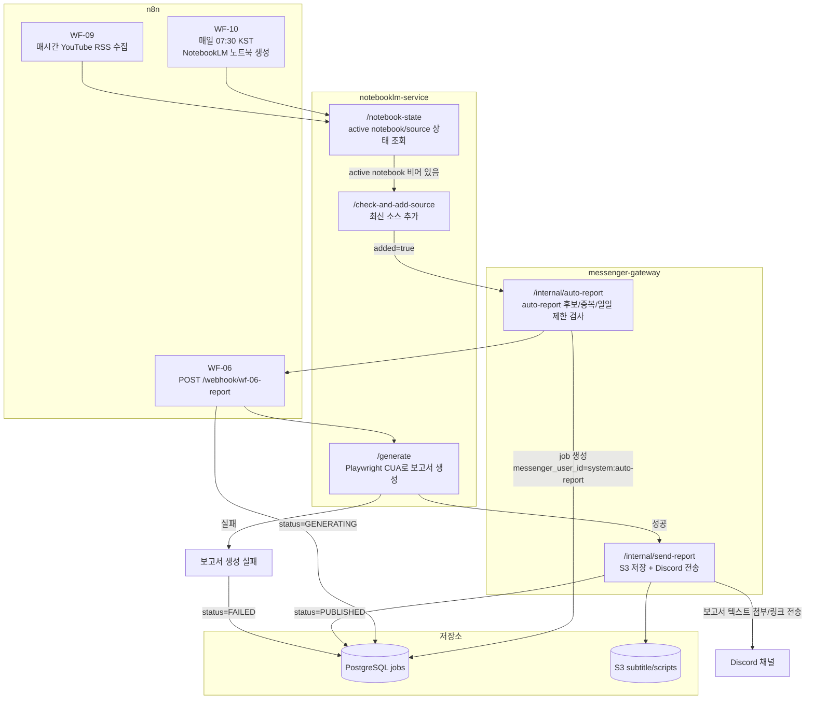
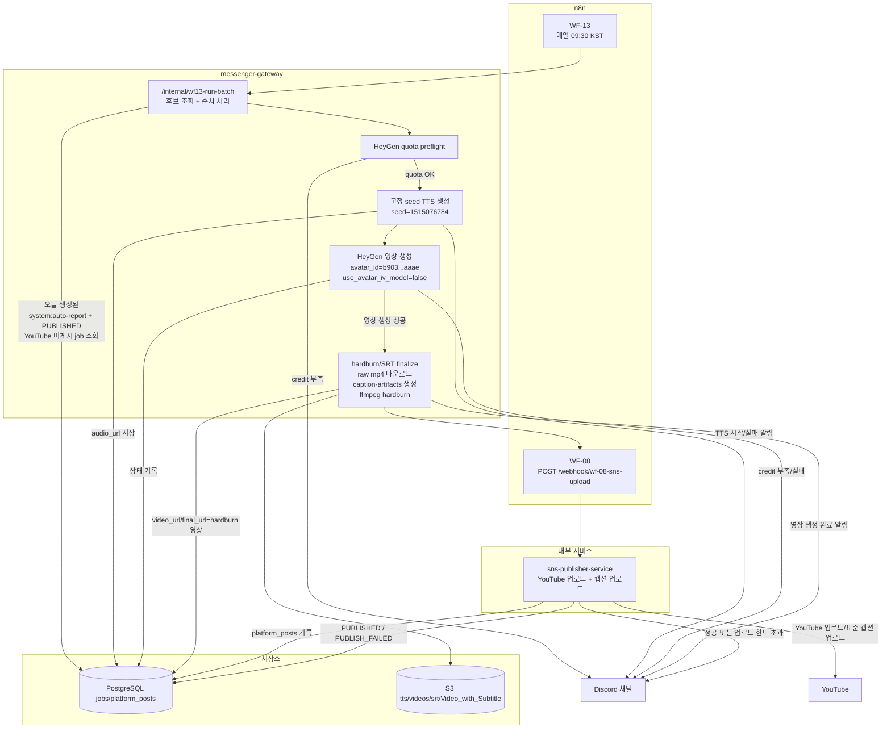

# AI Influencer Automation Pipeline — Phase 1

Discord 기반 AI 인플루언서 자동화 파이프라인.

테스트 편의를 위해 https://github.com/DJAeun/SKN22-Final-4Team-AI/tree/develop 클론
---
TTS Server Run script=
bash /workspace/runpod-stack/bin/start-all.sh
---

## 아키텍처 개요

```
[Discord 사용자]
      │  /report   /jobs   /tts   /seedlab   /cost
      ▼
[discord-bot]  ──────────────────────────────────→  [messenger-gateway :8080]
                                                              │  /internal/*
                                    ┌─────────────────────────┤
                                    ▼                         ▼
                             [PostgreSQL]      [n8n :5678 / WF-01,04,05,06,08,09,10,11,12]
                                    ▲
                                    │                         │
                                    └──────────────────────── ┤
                                                              │
                                                  [notebooklm-service]
                                                  (report 생성, notebook 관리)
```

### 서비스 구성

| 서비스 | 역할 | 포트 |
|--------|------|------|
| `postgres` | 데이터 저장소 | 내부 5432 |
| `n8n` | 워크플로 엔진 | 5678 (외부) |
| `messenger-gateway` | 메신저 허브 API | 8080 (외부) |
| `discord-bot` | Discord WebSocket 연결 | 없음 |
| `notebooklm-service` | NotebookLM 자동화 & 보고서 생성 | 내부 전용 |
| `sns-publisher-service` | YouTube/Instagram 업로드, YouTube 자막 생성 | 내부 전용 |
| `heygen-pipeline-service` | 생성 콘텐츠 메타데이터 등록 전용 | 내부 전용 |
| `tts-router-service` | TTS 라우팅/서버리스 전환용 라우터 | 내부 전용 |
| `seed-lab-service` | Seed Lab run 생성, 큐, AI 평가, 웹 API | 내부 전용 |

---

## 워크플로 전체 흐름 개요

```
자동 수집 (WF-09/10)                          수동 요청 (/report)
       │                                             │
       ▼                                             ▼
[YouTube RSS 수집]                            [채널 선택 버튼 표시]
[notebooklm 소스 추가]                               │
       │ (성공 시 auto-report)                       │
       └──────────────→ [gateway /internal/auto-report]
                               │
                          [WF-06: 보고서 생성]
                               │
                       [Discord 자동 보고서 전송]
                                                               │
       │                                                  [채널 선택]
       [WF-10: 매일 노트북 생성]                            │
                                                        [보고서 목록 조회]
                                                               │
                                                        [WF-06: 보고서 생성]
                                                               │
                                                          [영상 제작 요청]
```

---

## 현재 자동화 파이프라인 상세 구조

현재 실운영 자동화는 크게 두 단계입니다.

1. 아침까지 `WF-09/10 -> auto-report -> WF-06` 경로로 `system:auto-report` 보고서 job을 만든다.
2. 오전 9시 30분(KST) `WF-13`이 같은 날 생성된 `system:auto-report + PUBLISHED` job을 순차 처리해 TTS, HeyGen, hardburn, YouTube 업로드를 수행한다.

중요한 점:

- `WF-06`은 n8n UI에서 단독 실행하는 배치가 아니라, `messenger-gateway`가 webhook으로 호출하는 구조입니다.
- `WF-13`은 n8n 내부 루프가 아니라, `messenger-gateway /internal/wf13-run-batch`가 실제 순차 실행과 재시도, quota 검사까지 담당합니다.

### 1. 콘텐츠 생성 자동화 (`WF-09/10 -> auto-report -> WF-06`)



운영 메모:

- `WF-09`는 source 추가 성공 시에만 `messenger-gateway /internal/auto-report`를 호출합니다.
- `auto-report`는 `system:auto-report` job을 만들고, 그 job이 이후 `WF-13`의 입력이 됩니다.
- 보고서가 안 만들어지면 먼저 `jobs.status`, 그다음 `notebooklm-service`의 `/generate` 로그를 확인하면 됩니다.
- 최근 실제 장애처럼 NotebookLM UI 변경이 있으면 `WF-06`은 호출되더라도 `notebooklm-service /generate` 단계에서 `FAILED`로 종료될 수 있습니다.

### 2. 오전 9시 30분 자동 업로드 (`WF-13 -> wf13-run-batch -> WF-08`)



운영 메모:

- `WF-13` 자체는 단순히 `messenger-gateway /internal/wf13-run-batch`를 한 번 호출합니다.
- 실제 순차 처리, TTS 재시도, HeyGen quota 중단, YouTube 업로드 재시도/예외 분류는 모두 gateway 내부 로직이 담당합니다.
- publish 단계는 `WF-08 -> sns-publisher-service` 경로를 재사용합니다.
- `uploadLimitExceeded`가 나면 자동 배치는 다음 job으로 진행하고, 이미 만든 hardburn 영상 링크만 Discord로 반환합니다.
- 아침 보고서는 정상인데 영상/업로드가 안 생기면 `messenger-gateway`의 `wf13_run_batch/run_job` 로그와 `sns-publisher-service` 업로드 로그를 확인하면 됩니다.

---

## Discord 명령어 사용 흐름 (실운영)

### `/report [prompt]` (공백 허용)

```
/report
  → /internal/report-message
  → 채널 선택 버튼
  → /internal/channel-select
  → notebooklm-service /list-reports (gpt-5.4 CUA list loop)
      ├─ 기존 보고서 선택: /internal/report-select(select)
      │   → notebooklm-service /get-report
      │   → Discord 전송 + jobs.script_json.script_text 저장
      ├─ 기존 보고서 없음: [🆕 새로 생성] 버튼 노출
      └─ 조회 실패/지연: [🔄 다시 조회] / [🆕 새로 생성] 버튼 노출
          (자동 fallback으로 바로 생성하지 않음)
      → 새로 생성 선택 시: /internal/report-select(new) → WF-06
          → notebooklm-service /generate
          → /internal/send-report
          → Discord 전송 + jobs.script_json.script_text 저장
  → 보고서 메시지 버튼 분기
      ├─ [🔊 TTS만 제작]
      │   → /internal/report-to-tts
      │   → WF-11 (auto_trigger_wf12=false, TTS 승인/반려 버튼 유지)
      └─ [🎬 영상으로 제작]
          → /internal/report-to-video
          → WF-11 (auto_trigger_wf12=true) → WF-12 자동 진행
```

### `/jobs [purpose]`

- `purpose`: `all | tts | heygen`
- 최근 job 목록(8자리 ID, 상태, script/audio 보유 여부) 조회

### `/tts [job_id]`

- `job_id`는 전체 UUID/8자리 prefix/미입력 모두 허용
- 미입력 시 현재 사용자+채널의 최근 `script_text` 보유 job 자동 선택
- 실행 경로: `/internal/tts-generate` → WF-11

### `/cost`

- 실행 경로: `/internal/cost-viewer-link`
- Discord ephemeral 응답으로 Cost Viewer signed link 반환

### `/heygen [job_id]`

- 현재 `/heygen` 명령은 비활성화되어 있습니다.
- WF-12 실행은 TTS 완료 메시지의 `일반 승인` 또는 `고화질 승인` 버튼에서만 시작합니다.
- 즉 Discord 봇이 `/heygen` slash command를 직접 WF-12로 연결하지 않습니다.

### `POST /internal/heygen-smoke-test`

- HeyGen 실제 영상 생성 전에 인증/잔여 quota/avatar 접근만 검증
- 영상 생성은 호출하지 않으므로 과금 없는 스모크 테스트 용도
- 선택 body: `{ "avatar_id": "..." }`
- 응답에 현재 WF-12 기본값(`width/height/caption/speed/poll/max_wait/mock`)도 포함

### 시간별 자동 보고서 Discord 전송

- `WF-09 -> /internal/auto-report -> WF-06` 경로는 계속 동작
- Discord 전송은 `AUTO_REPORT_DISCORD_DELIVERY_ENABLED=true` 일 때 활성화
- 기본값은 `true`
- `system:auto-report` 실패 건은 Discord에 실패 메시지를 전송하지 않고 DB 상태만 `FAILED`로 기록
- 이때도 대본 rewrite, S3 저장, DB 업데이트는 그대로 수행

### `POST /internal/character-avatar`

- 캐릭터 기본 HeyGen 아바타를 DB 상태로 저장
- body: `{ "character_id": "default-character", "avatar_id": "..." }`
- 빈 문자열을 보내면 캐릭터 기본 avatar를 제거하고 다음 우선순위(job/env fallback)로 내려감

---

## 파일명 규칙 (전 워크플로우 공통)

- 기준 규칙: `YYYYMMDD-{job_id}.{ext}`
- 날짜 기준 타임존: `Asia/Seoul`
- `job_id`는 전체 UUID를 사용
- 동일 job의 산출물은 basename을 공유
  - 대본: `YYYYMMDD-{job_id}.txt`
  - TTS: `YYYYMMDD-{job_id}.wav`
  - 영상(메타): `YYYYMMDD-{job_id}.mp4`

예시 (`job_id=550e8400-e29b-41d4-a716-446655440000`, 2026-03-26 생성):
- `20260326-550e8400-e29b-41d4-a716-446655440000.txt`
- `20260326-550e8400-e29b-41d4-a716-446655440000.wav`
- `20260326-550e8400-e29b-41d4-a716-446655440000.mp4`

---

## 교차 계정 S3 저장 전략

- 저장 대상: 대본(`.txt`), TTS(`.wav`), 영상(`.mp4`)
- 저장 위치: **다른 AWS 계정의 S3 버킷**
- 접근 방식: **AssumeRole + 비공개 버킷 + Presigned URL**
- 객체 키: `reports/`, `tts/`, `videos/` prefix + `YYYYMMDD-{job_id}.{ext}`

### Discord 전송 정책

- 파일 크기 ≤ 10MB: Discord 파일 첨부 전송
- 파일 크기 > 10MB: Discord 텍스트 메시지로 Presigned URL 전송(기본 24시간)
- 링크 전송 메시지에서도 기존 버튼 UX를 유지
  - 보고서: `[🔊 TTS만 제작]`, `[🎬 영상으로 제작]`
  - TTS: `[✅ 승인 (WF-12 진행)] [❌ 반려]`

### 필수 환경변수

| 변수 | 설명 |
|------|------|
| `MEDIA_S3_BUCKET` | 타겟 S3 버킷명(타 AWS 계정) |
| `MEDIA_S3_REGION` | S3 리전 |
| `MEDIA_S3_ROLE_ARN` | 타겟 계정에서 AssumeRole 할 IAM Role ARN |
| `MEDIA_S3_EXTERNAL_ID` | (선택) 외부 ID |
| `MEDIA_S3_ROLE_SESSION_NAME` | STS 세션명 |
| `MEDIA_PRESIGN_EXPIRES_SECONDS` | Presigned URL 만료(기본 86400) |
| `MEDIA_MAX_DISCORD_FILE_BYTES` | 첨부 임계치(기본 10485760, 10MB) |
| `MEDIA_S3_PREFIX_REPORTS` | 자막용 대본 prefix (기본 `subtitle`) |
| `MEDIA_S3_PREFIX_TTS` | TTS prefix (기본 `tts`) |
| `MEDIA_S3_PREFIX_VIDEOS` | 영상 prefix (기본 `videos`) |
| `MEDIA_S3_PREFIX_SRT` | SRT prefix (기본 `srt`) |
| `MEDIA_S3_PREFIX_VIDEOS_WITH_SUBTITLE` | 하드번 영상 prefix (기본 `Video_with_Subtitle`) |

### AWS IAM 설정 요약 (교차 계정)

1. **타겟 계정(S3 보유)**에 업로드 전용 Role 생성 (예: `AiInfluencerMediaWriterRole`)
2. Trust policy에서 소스 계정의 실행 Role(EC2/ECS)을 Principal로 허용
3. 권한은 버킷 전체가 아닌 `subtitle/*`, `scripts/*`, `tts/*`, `videos/*`, `srt/*`, `Video_with_Subtitle/*` prefix로 최소권한 부여
4. 소스 계정 실행 Role에 `sts:AssumeRole` 권한 추가

---

## 워크플로 상세 흐름

### WF-01: 콘텐츠 생성 요청 수신 (레거시, 현재 실운영 미사용)

```
[Webhook 수신] ← discord-bot /create 요청
      │
      ▼
[요청 파싱] job_id, concept_text, messenger 정보
      │
      ▼
[DB 저장] jobs 테이블 INSERT, status=SCRIPTING
      │
      ▼
[스크립트 생성] (AI 스크립트 생성 로직)
      │
      ▼
[DB 업데이트] status=WAITING_APPROVAL, script 저장
      │
      ▼
[gateway /internal/send-confirm 호출]
→ Discord에 스크립트 + [✅ 승인하기] [✏️ 수정 지시] 버튼 전송
```

---

### WF-04: 컨펌 재요청

```
[Webhook 수신] ← gateway confirm 재요청
      │
      ▼
[요청 파싱] job_id
      │
      ▼
[DB 조회] jobs 테이블에서 스크립트 조회
      │
      ▼
[gateway /internal/send-confirm 호출]
→ Discord에 기존 스크립트 + 버튼 재전송
```

---

### WF-05: 승인/수정 처리

```
[Webhook 수신] ← discord-bot 버튼 클릭 이벤트
      │
      ▼
[요청 파싱] job_id, action (approved / revision_requested)
      │
      ├─[approved]──────────────────────────────────────────→ [WF-11 Webhook 호출]
      │                                                         영상 제작 파이프라인 시작
      │
      └─[revision_requested]──→ [DB 업데이트] revision_note 저장
                                      │
                                      ▼
                                [WF-01 재실행] 수정 지시 반영한 스크립트 재생성
```

---

### WF-06: NotebookLM 보고서 생성

```
[Webhook 수신] ← gateway /internal/report-to-video 또는 /report 요청
      │
      ▼
[요청 파싱] job_id, prompt, notebook_id, channel_id
      │
      ▼
[DB 업데이트] status=GENERATING
      │
      ▼
[notebooklm-service /generate 호출]
      │
      ├─[성공]──→ [gateway /internal/send-report 호출]
      │           → Discord에 보고서 텍스트 + [🔊 TTS만 제작] [🎬 영상으로 제작] 버튼 전송
      │
      └─[실패]──→ [gateway /internal/send-text 호출]
                  → Discord에 오류 메시지 전송
```

---

### WF-11: TTS 생성 + Discord 공유

```
[Webhook 수신] ← WF-05 승인 / report_to_tts / report_to_video / 재생성
      │
      ▼
[요청 파싱] job_id, script_text, auto_trigger_wf12
      │
      ▼
[DB 업데이트] status=GENERATING
      │
      ▼
[TTS 생성 + WAV 저장] /home/node/.n8n/audio
      │
      ▼
[gateway /internal/send-audio 호출]
→ Discord에 WAV 전송
    ├─ auto_trigger_wf12=false: [✅ 승인(WF-12)] [❌ 반려] 버튼 전송
    └─ auto_trigger_wf12=true : 승인 버튼 없이 안내 후 WF-12 자동 진행
      │
      ▼
[DB 업데이트] status=APPROVED, audio_url 저장
      │
      ├─[auto_trigger_wf12=true]─→ [WF-12 호출]
      └─[기본]──────────────────→ Discord에서 승인 대기
```

---

### WF-12: HeyGen 영상 생성

```
[Webhook 수신] ← Discord TTS 승인 또는 자동 트리거
      │
      ▼
[요청 파싱] job_id, channel_id, user_id, audio_file_path|audio_url
      │
      ▼
[DB 업데이트] status=GENERATING
      │
      ▼
[HeyGen 업로드 + 영상 생성 + 폴링]
      │
      ├─[completed]──→ [gateway /internal/send-video-preview 호출]
      │                      │
      │                      ▼
      │               [raw mp4 다운로드]
      │               [caption-artifacts로 SRT 생성]
      │               [ffmpeg hardburn]
      │               [raw / srt / hardburn S3 저장]
      │               [DB 업데이트] status=WAITING_VIDEO_APPROVAL,
      │                            video_url/final_url=hardburn 영상
      │               → Discord에 hardburn 미리보기 + [✅ 승인] [❌ 반려] 버튼
      │
      └─[failed]────→ [DB 업데이트] status=FAILED
                             │
                             ▼
                      [gateway /internal/send-text 호출]
```

---

### WF-08: SNS 업로드

```
[Webhook 수신] ← discord-bot 영상 승인 버튼 클릭
      │
      ▼
[요청 파싱] job_id, video_url, targets(youtube|instagram)
      │
      ▼
[DB 업데이트] status=PUBLISHING
      │
      ▼
[타깃별 업로드]
  ├─ YouTube 업로드
  └─ Instagram 업로드
      │
      ▼
[platform_posts INSERT] 각 플랫폼 게시물 ID 저장
      │
      ▼
[DB 업데이트] status=PUBLISHED | PARTIALLY_PUBLISHED | PUBLISH_FAILED
      │
      ▼
[gateway /internal/send-text 호출]
→ Discord에 업로드 완료 알림 전송
```

---

### WF-09: YouTube 소스 자동 수집 (매시간)

```
[Schedule Trigger] 매시간 실행
      │
      ▼
[채널 목록 파싱] TOPIC_CHANNELS 환경변수
  형식: 채널이름/채널ID+채널이름/채널ID+...
  → [{channelId, channelName}, ...] 목록 생성
      │
      ▼
[IF: 채널 존재 여부 확인]
  ├─[skip=true]──→ 종료
  │
  └─[유효]──→ [notebooklm-service /notebook-state 조회]
                │
                ▼
        [IF: active notebook에 기존 source 존재]
          ├─[있음]──→ 종료
          │           reason: active notebook already has sources
          │
          └─[없음]──→ [YouTube RSS 조회] (채널별 병렬 처리)
                        https://www.youtube.com/feeds/videos.xml?channel_id={channelId}
                              │
                              ▼
                      [새 영상 필터링]
                      최근 N시간(`WF09_LOOKBACK_HOURS`) 이내 업로드만 유지
                              │
                              ▼
                      [최신 1개만 선택]
                              │
                              ▼
                      [IF: 선택 결과 존재 여부]
                        ├─[없음]──→ 종료
                        │           reason: no recent video within lookback
                        │
                        └─[있음]──→ [notebooklm-service /check-and-add-source 호출]
                                      { source_url, source_title, channel_name }
                                            │
                                            ▼
                                    [결과 로깅]
                                    소스 추가 완료 / 오류
                                            │
                            [added=true일 때만 자동 보고서 트리거]
                                            ▼
                      [gateway /internal/auto-report]
                       - job_id 자동 생성
                       - Discord 전송 채널: DISCORD_ALLOWED_CHANNEL_IDS 첫 번째
                       - WF-06 호출 → 보고서 생성/첨부 전송
```

---

### WF-10: 일일 노트북 생성 (매일 오전 7시 30분, KST)

```
[Schedule Trigger] 매일 07:30 실행 (Asia/Seoul)
      │
      ▼
[채널 목록 파싱] TOPIC_CHANNELS 환경변수
  형식: 채널이름/채널ID+채널이름/채널ID+...
  → [{topic(=채널이름), channelIds, notebookName}, ...] 목록 생성
      │
      ▼
[IF: 채널 존재 여부 확인]
  ├─[skip=true]──→ 종료
  │
  └─[유효]──→ [notebooklm-service /create-notebook 호출] (채널별)
                { name: "채널이름 YYYY-MM-DD", topic: 채널이름, channel_ids: [channelId] }
                      │
                      ▼
              [결과 로깅]
              노트북 생성 완료(notebook_id, notebook_url) / 오류
```

---

### 보고서 요청 전체 흐름 (/report 명령어)

```
Discord 사용자: /report
      │
      ▼
[discord-bot] → [gateway /internal/report-message]
                        │
                        ▼
               [TOPIC_CHANNELS 기반 채널 목록 생성]
                        │
                        ▼
               [Discord 채널 선택 버튼 전송]
                [채널A] [채널B] [채널C] ...
                        │
      사용자가 채널 버튼 클릭
                        │
                        ▼
[discord-bot] → [gateway /internal/channel-select]
                 { job_id, channel_id }
                        │
                        ▼
               [notebooklm-service /list-reports 조회]
               → 해당 채널의 기존 보고서 목록
                        │
                ┌───────────┬───────────────┬────────────────────────┐
         [보고서 있음]  [보고서 없음]   [조회 실패/지연]
                │            │               │
                ▼            ▼               ▼
   [Discord 보고서 선택 버튼]  [🆕 새로 생성]  [🔄 다시 조회] [🆕 새로 생성]
   [보고서1] [보고서2] [새로 생성]  버튼 노출      버튼 노출 (자동 fallback 없음)
                │            │               │
      사용자가 선택          └──────┬────────┘
                │                   │
       ├─[기존 보고서 선택]──→ Discord에 보고서 전송
       │
       └─[새로 생성]────────→ [WF-06 실행] → 보고서 생성 → 전송
```

---

## n8n/workflows 파일별 전체 흐름 요약

현재 저장소의 `ai-influencer/n8n/workflows`에는 아래 9개 워크플로가 있습니다.

| 파일 | 트리거 | 진입점 | 핵심 처리 | 후속 |
|------|--------|--------|-----------|------|
| `WF-01_input_receive.json` | Webhook | `POST /webhook/wf-01-input` | 레거시 `/create` 경로용 job 수신, `SCRIPTING` 전이, 스크립트 생성/저장 | gateway `/internal/send-confirm` |
| `WF-04_confirm_request.json` | Webhook | `POST /webhook/wf-04-confirm-request` | 기존 스크립트/상태 조회 후 컨펌 재전송 | gateway `/internal/send-confirm` |
| `WF-05_confirm_handler.json` | Webhook | `POST /webhook/wf-05-confirm` | 승인/수정 분기 및 상태 업데이트 | 승인→WF-11, 수정→WF-01 |
| `WF-06_notebooklm_report.json` | Webhook | `POST /webhook/wf-06-report` | NotebookLM 보고서 생성 호출, 성공/실패 분기 | 성공→`/internal/send-report`, 실패→`/internal/send-text` |
| `WF-08_sns_upload.json` | Webhook | `POST /webhook/wf-08-sns-upload` | `PUBLISHING` 전이, SNS 업로드 처리, post 기록 | 완료 알림 + `PUBLISHED` |
| `WF-09-youtube-source.json` | Schedule(매시간) | n8n 스케줄 | `TOPIC_CHANNELS` 파싱, active notebook이 비어 있을 때만 RSS 조회, 최근 시간창 안의 최신 영상 1개만 선택 | source 추가 성공 시에만 gateway `/internal/auto-report` → WF-06 |
| `WF-10-daily-notebook.json` | Schedule(매일 07:30 KST) | n8n 스케줄 | 채널별 노트북 생성 요청 | notebooklm-service `/create-notebook` |
| `WF-11_tts_generate.json` | Webhook | `POST /webhook/wf-11-tts-generate` | TTS 생성, WAV 저장, Discord 전송, `audio_url` 저장 | 승인 대기 또는 자동 WF-12 |
| `WF-12_heygen_generate.json` | Webhook | `POST /webhook/WF12HeygenV2Run/webhook/wf-12-heygen-generate-v2` | HeyGen 생성/폴링 또는 mock preview 생성 | 성공→`/internal/send-video-preview`, 실패→`/internal/send-text` |

참고:
- 기존 단일 워크플로 `WF-07`은 삭제되었고, `WF-11`/`WF-12`로 완전 분리되었습니다.

---

## 사전 요구사항

- AWS EC2 t3.large (x86_64, Ubuntu 22.04 이상) 또는 동급 서버
- **Docker** + **Docker Compose v2.24+** 설치
- **Discord Bot Token** (Discord Developer Portal에서 발급)
  - Privileged Gateway Intents: **Message Content Intent** 활성화 필수
  - Bot Permissions: Send Messages, Read Message History, Add Reactions, Use Application Commands
- 인바운드 포트 오픈: **5678** (n8n), **8080** (messenger-gateway)

---

## 서버 초기 세팅 (최초 1회)

### 1. SSH 접속

```bash
ssh -i your-key.pem ubuntu@<서버-퍼블릭-IP>
```

### 2. Docker 설치

```bash
# 패키지 업데이트
sudo apt-get update && sudo apt-get upgrade -y

# Docker 공식 GPG 키 및 저장소 추가
sudo apt-get install -y ca-certificates curl gnupg
sudo install -m 0755 -d /etc/apt/keyrings
curl -fsSL https://download.docker.com/linux/ubuntu/gpg | sudo gpg --dearmor -o /etc/apt/keyrings/docker.gpg
sudo chmod a+r /etc/apt/keyrings/docker.gpg
echo "deb [arch=$(dpkg --print-architecture) signed-by=/etc/apt/keyrings/docker.gpg] \
  https://download.docker.com/linux/ubuntu $(. /etc/os-release && echo "$VERSION_CODENAME") stable" \
  | sudo tee /etc/apt/sources.list.d/docker.list > /dev/null

# Docker 설치
sudo apt-get update
sudo apt-get install -y docker-ce docker-ce-cli containerd.io
sudo usermod -aG docker $USER
newgrp docker
```

### 3. Docker Compose v2 설치

```bash
# x86_64 기준 (ARM이면 aarch64로 변경)
sudo curl -SL https://github.com/docker/compose/releases/download/v2.24.0/docker-compose-linux-x86_64 \
  -o /usr/local/bin/docker-compose
sudo chmod +x /usr/local/bin/docker-compose
docker-compose --version
# Docker Compose version v2.24.0
```

### 4. 코드 클론

```bash
# 저장소 전체 클론
git clone https://github.com/<org>/SKN22-Final-4Team-AI.git
cd SKN22-Final-4Team-AI/ai-influencer
```

---

## 배포 및 실행

### 5. 환경변수 설정

```bash
cp .env.example .env
nano .env   # 또는 vi .env
```

`.env` 파일은 .env.example 파일을 복사하여 사용해주세요.

**주요 환경변수:**

| 변수 | 설명 | 예시 |
|------|------|------|
| `POSTGRES_DB` | PostgreSQL DB명 | `ai_influencer` |
| `POSTGRES_USER` | DB 사용자 | `aiuser` |
| `POSTGRES_PASSWORD` | DB 비밀번호 | |
| `GATEWAY_INTERNAL_SECRET` | 내부 서비스 인증 키 | |
| `DISCORD_BOT_TOKEN` | Discord Bot 토큰 | |
| `DISCORD_ALLOWED_USER_IDS` | (레거시) 자동화 파이프라인에서는 미사용. 별도 `/server` Lambda 권한 모델에서만 사용 가능 | `12345,67890` |
| `DISCORD_ALLOWED_CHANNEL_IDS` | Discord 자동화 허용 채널 ID (쉼표 구분). 봇 명령/버튼은 이 채널들에서만 동작 | `11111,22222` |
| `AUTO_REPORT_MAX_ATTEMPTS_PER_DAY` | auto-report 일일 최대 시도 횟수(채널+노트북 기준) | `3` |
| `AUTO_REPORT_STALE_MINUTES` | auto-report 진행중 job stale 판정(분) | `45` |
| `DISCORD_GUILD_ID` | (선택) 슬래시 명령 즉시 반영용 Guild ID | `123456789012345678` |
| `N8N_RUNNERS_TASK_TIMEOUT` | n8n task runner 실행 제한(초) | `1200` |
| `NOTEBOOKLM_SERVICE_URL` | notebooklm-service 내부 URL | `http://notebooklm-service:8090` |
| `N8N_WF01_WEBHOOK_URL` | WF-01 입력 웹훅 URL | `http://n8n:5678/webhook/Mt5nwvystMhfO1nl/webhook/wf-01-input` |
| `N8N_WF05_WEBHOOK_URL` | WF-05 컨펌 웹훅 URL | `http://n8n:5678/webhook/gD9A0qy9MxY8g0T6/webhook/wf-05-confirm` |
| `N8N_WF06_WEBHOOK_URL` | WF-06 보고서 웹훅 URL | `http://n8n:5678/webhook/QSrXdaRpKosyZIj3/webhook/wf-06-report` |
| `N8N_WF08_WEBHOOK_URL` | WF-08 업로드 웹훅 URL | `http://n8n:5678/webhook/uLRW8JT5UitrhCC9/webhook/wf-08-sns-upload` |
| `NOTEBOOKLM_MAX_SOURCES` | 채널당 최대 소스 수 | `20` |
| `WF09_LOOKBACK_HOURS` | WF-09 새 영상 판정 시간창(시간). 빈 active notebook에도 항상 적용됨 | `24` |
| `TOPIC_CHANNELS` | YouTube 채널 목록 | `채널A/UCxxxxxxxxxxxxxxxxxxxxxx+채널B/UCyyyyyyyyyyyyyyyyyyyyyy` |
| `N8N_WF11_WEBHOOK_URL` | WF-11(TTS) 웹훅 URL | `http://n8n:5678/webhook/Wv5SdSdlPLwNzeqF/webhook/wf-11-tts-generate` |
| `N8N_WF12_WEBHOOK_URL` | WF-12(HeyGen) 웹훅 URL | `http://n8n:5678/webhook/WF12HeygenV2Run/webhook/wf-12-heygen-generate-v2` |
| `YOUTUBE_CLIENT_ID` | YouTube 업로드 OAuth Client ID | |
| `YOUTUBE_CLIENT_SECRET` | YouTube 업로드 OAuth Client Secret | |
| `YOUTUBE_REFRESH_TOKEN` | YouTube 업로드 Refresh Token | |
| `INSTAGRAM_PAGE_ACCESS_TOKEN` | Instagram Graph API 토큰 | |
| `INSTAGRAM_IG_USER_ID` | Instagram 비즈니스 계정 ID | |
| `INSTAGRAM_PAGE_ID` | (선택) 현재 업로드 경로에서는 미사용(운영 참고용) | |
| `TTS_API_URL` | TTS API 서버 주소 | `https://...trycloudflare.com` |
| `TTS_ROUTER_MODE` | TTS Router 모드 (`legacy_http`/`runpod_serverless`) | `legacy_http` |
| `TTS_REF_AUDIO_PATH` | (선택) 음색 클론용 참조 오디오 경로 | `/workspace/reference.wav` |
| `TTS_PROMPT_TEXT` | (선택) 참조 오디오 실제 문장 | `안녕하세요 ...` |
| `TTS_FIXED_SEEDS` | (선택) 채널 공통 고정 seed 3개(쉼표 구분) | `101,202,303` |
| `HEYGEN_API_KEY` | HeyGen Direct API 키 | |
| `HEYGEN_AVATAR_ID` | 아바타 ID 6개(쉼표 구분). 버튼 라벨은 각 ID 앞 6글자 | |
| `HEYGEN_VIDEO_WIDTH` | WF-12 출력 영상 너비 | `1080` |
| `HEYGEN_VIDEO_HEIGHT` | WF-12 출력 영상 높이 | `1920` |
| `HEYGEN_CAPTION_ENABLED` | HeyGen caption 사용 여부 | `false` |
| `HEYGEN_SPEED` | WF-12 audio voice speed | `1.3` |
| `HEYGEN_POLL_INTERVAL_SECONDS` | HeyGen 상태 polling 간격(초) | `10` |
| `HEYGEN_MAX_WAIT_SECONDS` | HeyGen 최대 대기 시간(초) | `900` |
| `HEYGEN_MOCK_ENABLED` | WF-12 mock preview 모드 | `false` |
| `HEYGEN_MOCK_VIDEO_URL` | mock 모드 샘플 mp4 URL | `https://samplelib.com/lib/preview/mp4/sample-5s.mp4` |
| `GOOGLE_EMAIL` | NotebookLM 구글 계정 | |
| `GOOGLE_PASSWORD` | NotebookLM 구글 비밀번호 | |
| `OPENAI_FALLBACK_API_KEY` | OpenAI 공통 fallback 키(미설정 기능에서 공통 사용) | |
| `OPENAI_API_KEY` | 레거시 fallback 키(하위 호환용, 가능하면 `OPENAI_FALLBACK_API_KEY` 사용 권장) | |
| `OPENAI_API_KEY_REWRITE` | 대본 Rewrite 전용 키 (TTS/SUBTITLE 동시 생성 기능) | |
| `OPENAI_API_KEY_CUA_CREATE_NOTEBOOK` | CUA 노트북 생성 전용 키 | |
| `OPENAI_API_KEY_CUA_MANAGE_SOURCES` | CUA 소스 관리 전용 키 | |
| `OPENAI_API_KEY_CUA_GENERATE_REPORT` | CUA 보고서 생성 전용 키 | |
| `OPENAI_API_KEY_YOUTUBE_ASR` | YouTube 자막 ASR 전용 키 | |
| `OPENAI_API_KEY_CONTENT_METADATA` | 콘텐츠 메타데이터 생성 전용 키 | |
| `OPENAI_API_KEY_CONTENT_EMBEDDING` | 콘텐츠 임베딩 생성 전용 키 | |
| `OPENAI_API_KEY_SEEDLAB_ASR` | Seed Lab ASR 전용 키 | |
| `OPENAI_API_KEY_SEEDLAB_JUDGE` | Seed Lab Judge 전용 키 | |

기본 경로: WF-11은 앞선 워크플로에서 전달된 `script_text`를 그대로 TTS 입력으로 사용합니다.  
음색 클론이 필요할 때만 `TTS_REF_AUDIO_PATH` + `TTS_PROMPT_TEXT`를 **둘 다** 설정하세요.

고정 seed를 쓰려면 `TTS_FIXED_SEEDS`를 설정하세요.
- 형식: 반드시 정수 3개(쉼표 구분), 중복 없음, 범위 `1..2147483647`
- 우선순위: `TTS_FIXED_SEEDS` > 랜덤
- 설정값 오류 시 서비스는 중단되지 않고 랜덤 seed 3개로 fallback합니다.

**`TOPIC_CHANNELS` 형식:**
```
TOPIC_CHANNELS=채널이름/채널ID+채널이름/채널ID+...
예: 채널A/UCxxxxxxxxxxxxxxxxxxxxxx+채널B/UCyyyyyyyyyyyyyyyyyyyyyy
```
- 채널이름: 노트북 및 보고서 식별 키로 사용됨
- 채널ID: YouTube 채널 ID (UC로 시작하는 24자리)

자동 보고서(auto-report) 경로에서는 `DISCORD_ALLOWED_CHANNEL_IDS`의 **첫 번째 채널 ID만** 전송 대상으로 사용합니다.  
허용 채널 안에서는 특정 유저 제한 없이 팀원 누구나 `/report`, `/tts`, `/jobs`, `/seedlab`, `/cost` 및 승인 버튼을 사용할 수 있습니다.

### 6. 전체 서비스 빌드 및 기동

```bash
docker-compose up -d --build
```

상태 확인:

```bash
docker-compose ps
# 모든 서비스 State: Up 확인
```

로그 확인:

```bash
docker-compose logs -f               # 전체
docker-compose logs -f messenger-gateway
docker-compose logs -f discord-bot
docker-compose logs -f n8n
docker-compose logs -f notebooklm-service
```

---

## n8n 워크플로 설정

### 7. n8n 접속 및 Postgres 크레덴셜 등록

1. 브라우저에서 `http://<서버-퍼블릭-IP>:5678` 접속
2. `.env`의 `N8N_BASIC_AUTH_USER` / `N8N_BASIC_AUTH_PASSWORD`로 로그인
3. `.env`에 `N8N_POSTGRES_CREDENTIAL_NAME=pg-credentials` 확인 (다르게 쓸 경우 해당 이름으로 생성)
4. 좌측 메뉴 **Settings → Credentials → + New Credential → PostgreSQL** 선택
5. 아래 값 입력 후 **Save** (이름은 `N8N_POSTGRES_CREDENTIAL_NAME` 값과 동일해야 함):

   | 항목 | 값 |
   |------|-----|
   | Name | `pg-credentials` |
   | Host | `postgres` |
   | Port | `5432` |
   | Database | `.env`의 `POSTGRES_DB` |
   | User | `.env`의 `POSTGRES_USER` |
   | Password | `.env`의 `POSTGRES_PASSWORD` |

### 8. 워크플로 임포트

1. 좌측 메뉴 **Workflows → + New Workflow**
2. 우상단 **⋮ (점 3개) → Import from file** 으로 아래 파일을 각각 임포트:

   | 파일 | 설명 | 트리거 |
   |------|------|--------|
   | `WF-01_input_receive.json` | 레거시 콘텐츠 생성 요청 수신 | Webhook |
   | `WF-04_confirm_request.json` | 컨펌 재요청 | Webhook |
   | `WF-05_confirm_handler.json` | 승인/수정 처리 | Webhook |
   | `WF-06_notebooklm_report.json` | 보고서 생성 | Webhook |
   | `WF-11_tts_generate.json` | TTS 생성 + Discord 공유 | Webhook |
   | `WF-12_heygen_generate.json` | HeyGen 영상 생성 | Webhook |
   | `WF-08_sns_upload.json` | SNS 업로드 | Webhook |
   | `WF-09-youtube-source.json` | YouTube 소스 자동 수집 | 매시간 Schedule |
   | `WF-10-daily-notebook.json` | 일일 노트북 생성 | 매일 07:30 KST Schedule |

3. 수동 재선택은 기본적으로 불필요합니다. 컨테이너 기동 시 `sync_workflows.js`가 `N8N_POSTGRES_CREDENTIAL_NAME` 기준으로 Postgres credential id를 자동 매핑합니다.
4. 각 워크플로 우상단 **Active 토글 ON** → **Save**

> **워크플로 수정 시 재임포트 방법 (docker 재빌드 불필요):**
> ```bash
> git pull   # 로컬 변경사항 서버에 반영
> ```
> n8n UI에서 기존 워크플로 삭제 → 새 JSON 파일로 재임포트

---

## 헬스체크

```bash
# Gateway 상태
curl http://localhost:8080/health
# {"status":"ok","db":"connected","adapters":["discord"]}

# n8n 상태
curl http://localhost:5678/healthz
# {"status":"ok"}

# 컨테이너 상태
docker-compose ps

# Postgres DB 접속 확인
docker-compose exec postgres psql -U aiuser -d ai_influencer -c "SELECT COUNT(*) FROM jobs;"
```

---

## 업데이트 배포

코드/워크플로 변경 시:

```bash
cd ~/SKN22-Final-4Team-AI/ai-influencer
git pull

# 코드 변경 (messenger-gateway, discord-bot, notebooklm-service) → 재빌드 필요
docker-compose up -d --build messenger-gateway discord-bot notebooklm-service

# docker-compose.yml 또는 .env 변경 → 해당 서비스만 재시작
docker-compose up -d --force-recreate n8n

# 전체 재시작
docker-compose up -d --build
```

---

## Discord 봇 설정 (Discord Developer Portal)

1. [https://discord.com/developers/applications](https://discord.com/developers/applications) 접속
2. **New Application** 생성
3. **Bot** 탭 → **Reset Token** → 토큰 복사 → `.env`의 `DISCORD_BOT_TOKEN`에 입력
4. **Bot** 탭 → **Privileged Gateway Intents**
   - **MESSAGE CONTENT INTENT** 토글 활성화 (필수)
5. **OAuth2 → URL Generator**
   - Scopes: `bot`, `applications.commands`
   - Permissions: `Send Messages`, `Read Message History`, `Add Reactions`
6. 생성된 URL로 봇을 서버에 초대

### Discord ID 확인 방법

Discord 설정 → **고급 → 개발자 모드** 활성화 후:
- **유저 ID**: 사용자 이름 우클릭 → **ID 복사**
- **채널 ID**: 채널명 우클릭 → **ID 복사**

---

## Server Control Lambda 설정 (`/server` 명령어)

EC2가 꺼진 상태에서도 Discord에서 `/server on/off/status`로 인스턴스를 제어하는 별도 Lambda 봇.
기존 `discord-bot`과 독립적으로 동작하며 같은 채널에 공존합니다.

### 아키텍처

```
Discord 사용자 (/server on/off/status)
    ↓ HTTPS POST (WebSocket 불필요)
API Gateway (항상 ON, serverless)
    ↓
Lambda (항상 ON, ~무료)
    ├─ 서명 검증 (Ed25519 / PyNaCl)
    ├─ on     → ec2.start_instances()
    ├─ off    → ec2.stop_instances()
    └─ status → ec2.describe_instances()
```

### 수동 배포 순서

#### 1. Discord Application 생성

1. [discord.com/developers/applications](https://discord.com/developers/applications) → **New Application**
2. **Bot** 탭 → **Reset Token** → 토큰 복사
3. **General Information** → **Public Key** 복사

#### 2. AWS IAM 역할 생성

**신뢰 정책** (역할 → 신뢰 관계 탭):

```json
{
  "Version": "2012-10-17",
  "Statement": [{
    "Effect": "Allow",
    "Principal": { "Service": "lambda.amazonaws.com" },
    "Action": "sts:AssumeRole"
  }]
}
```

**권한 정책** (인라인 정책 추가):

```json
{
  "Version": "2012-10-17",
  "Statement": [{
    "Effect": "Allow",
    "Action": [
      "ec2:StartInstances",
      "ec2:StopInstances",
      "ec2:DescribeInstances"
    ],
    "Resource": "*"
  }]
}
```

역할 이름: `discord-server-control-role`
추가 연결 정책: `AWSLambdaBasicExecutionRole` (CloudWatch 로그)

#### 3. Lambda 함수 생성 (AWS 콘솔)

1. AWS 콘솔 → **Lambda → 함수 생성 → 처음부터 작성**
   - 함수 이름: `discord-server-control`
   - 런타임: `Python 3.12`
   - 실행 역할 → 기존 역할 사용 → `discord-server-control-role`
2. **코드 업로드** — zip 파일 준비 후 업로드:
   ```bash
   cd ai-influencer/server-control-lambda
   mkdir package
   pip install PyNaCl==1.5.0 -t package/
   cp lambda_function.py package/
   cd package && zip -r ../function.zip . && cd ..
   ```
   함수 페이지 → **코드** 탭 → **업로드 위치 → .zip 파일** → `function.zip` 선택
3. **환경변수 설정** — **구성** 탭 → **환경 변수 → 편집**:

   | 키 | 값 |
   |----|-----|
   | `DISCORD_PUBLIC_KEY` | Discord 개발자 포털 Public Key |
   | `EC2_INSTANCE_ID` | `i-xxxxxxxxxxxxxxxxx` |
   | `EC2_REGION` | `ap-northeast-2` |
   | `DISCORD_ALLOWED_USER_IDS` | 허용할 Discord 유저 ID (쉼표 구분) |

4. **타임아웃 조정** — **구성** 탭 → **일반 구성 → 편집** → 타임아웃 `10초`

#### 4. API Gateway 생성

1. AWS 콘솔 → **API Gateway → HTTP API → 빌드**
2. 통합: **Lambda** → `discord-server-control` 선택
3. 라우트: `POST /discord`
4. 생성 후 **엔드포인트 URL** 복사

#### 5. Discord Interactions Endpoint 설정

1. Discord 개발자 포털 → 해당 Application → **General Information**
2. **Interactions Endpoint URL** = 4번에서 복사한 API Gateway URL
3. **Save Changes** → Discord가 PING 전송 → Lambda PONG 반환으로 자동 검증

#### 6. 슬래시 명령어 등록

```bash
cd ai-influencer/server-control-lambda
python register_command.py \
  --app-id <APPLICATION_ID> \
  --token  <BOT_TOKEN>
```

#### 7. 봇 서버 초대

1. Discord 개발자 포털 → **OAuth2 → URL Generator**
2. Scopes: `applications.commands`
3. 생성된 URL로 봇을 서버에 초대

### 환경변수 (`.env` 추가 항목)

| 변수 | 설명 |
|------|------|
| `EC2_INSTANCE_ID` | 제어할 EC2 인스턴스 ID |
| `EC2_REGION` | 인스턴스 리전 (기본값: `ap-northeast-2`) |
| `SERVER_CONTROL_DISCORD_PUBLIC_KEY` | Discord 개발자 포털 Public Key |
| `SERVER_CONTROL_DISCORD_APP_ID` | Discord Application ID |
| `SERVER_CONTROL_DISCORD_BOT_TOKEN` | Discord Bot Token |

---

## API 엔드포인트 (messenger-gateway)

모든 `/internal/*` 엔드포인트는 `X-Internal-Secret` 헤더 인증 필수.

| Method | Path | 호출자 | 설명 |
|--------|------|--------|------|
| `POST` | `/internal/message` | discord-bot | 레거시 `/create` 요청 수신 (현재 실운영 미사용) |
| `POST` | `/internal/send-confirm` | n8n WF-01/04 | 레거시 스크립트 컨펌 버튼 전송 |
| `POST` | `/internal/confirm-action` | discord-bot | 승인/수정 버튼 클릭 처리 |
| `POST` | `/internal/send-text` | n8n WF-05/08 | 일반 텍스트 전송 |
| `POST` | `/internal/video-action` | discord-bot | 영상 승인/재작업 버튼 처리 |
| `POST` | `/internal/send-video-preview` | n8n WF-12 | 영상 미리보기 전송 |
| `POST` | `/internal/send-audio` | n8n WF-11 | TTS WAV + 승인/반려 버튼 전송 |
| `POST` | `/internal/tts-action` | discord-bot | TTS 승인/반려 처리 (WF-12 트리거) |
| `POST` | `/internal/report-message` | discord-bot | /report 요청 → 채널 선택 버튼 |
| `POST` | `/internal/channel-select` | discord-bot | 채널 버튼 클릭 → 보고서 목록 |
| `POST` | `/internal/report-select` | discord-bot | 보고서 선택 또는 새로 생성 |
| `POST` | `/internal/send-report` | n8n WF-06 | 보고서 텍스트 전송 |
| `POST` | `/internal/auto-report` | n8n WF-09 | 소스 추가 성공 시 자동 WF-06 생성/전송 트리거 |
| `POST` | `/internal/report-to-tts` | discord-bot | 보고서 → TTS만 제작 요청 |
| `POST` | `/internal/report-to-video` | discord-bot | 보고서 → 영상 제작 요청 |
| `POST` | `/internal/tts-generate` | discord-bot | `/tts [job_id]` 수동 WF-11 실행 (미입력 시 최근 job 자동 선택) |
| `POST` | `/internal/jobs` | discord-bot | `/jobs [purpose]` 최근 job 목록 조회 (`all/tts/heygen`) |
| `POST` | `/internal/cost-viewer-link` | discord-bot | `/cost` signed Cost Viewer 링크 발급 |
| `GET`  | `/health` | 모니터링 | 헬스체크 |

---

## 테스트 시나리오

### 수집 대상 채널
1. https://www.youtube.com/@example-channel-a
2. https://www.youtube.com/@example-channel-b
3. https://www.youtube.com/@example-channel-c
4. https://www.youtube.com/@example-channel-d
5. https://www.youtube.com/@example-channel-e
6. https://www.youtube.com/@example-channel-f

### 보고서 생성 및 영상 제작 (/report)

1. Discord에서 `/report` 실행
   → 채널 선택 버튼 확인
2. 채널 선택 후 기존 보고서 목록 또는 새 보고서 생성 버튼 확인
3. 보고서 선택 또는 새 보고서 생성 완료 후 Discord에 대본 도착 확인
4. `TTS만 제작` 또는 `영상으로 제작` 버튼으로 WF-11/WF-12 진입 확인
5. TTS 승인 또는 자동 진행 후 영상 미리보기 수신, 승인 시 WF-08 실행 확인

### 보고서 조회 (/report)

1. Discord에서 `/report` 실행
   → 채널 선택 버튼 표시 (TOPIC_CHANNELS에 등록된 채널 수만큼)
2. 채널 버튼 클릭 → 해당 채널의 보고서 목록 표시
   (목록 조회 실패/지연 시 `[🔄 다시 조회] / [🆕 새로 생성]` 버튼 표시)
3. 보고서 선택 또는 [새로 생성] → 보고서 텍스트 수신
4. `[🔊 TTS만 제작]` 버튼 클릭 → WF-11 실행 (TTS 승인/반려 버튼 노출)
5. `[🎬 영상으로 제작]` 버튼 클릭 → WF-11 실행 후 WF-12 자동 진행

### 수동 TTS / HeyGen 실행

1. Discord에서 `/jobs purpose:tts` 또는 `/jobs purpose:heygen` 실행  
   → 최근 job 목록(8자리 short id, 상태, script/audio 보유 여부) 확인
2. Discord에서 `/tts job_id:<8자리 또는 전체 job_id>` 실행  
   → 해당 job의 `script_text`로 WF-11(TTS) 수동 실행
3. Discord에서 `/heygen job_id:<8자리 또는 전체 job_id>` 실행  
   → 해당 job의 `audio_url`로 WF-12(HeyGen) 수동 실행
4. `job_id`를 생략하고 `/tts` 또는 `/heygen`만 실행하면  
   → 현재 채널/사용자의 최근 적합 job을 자동 선택해 실행

사전조건:
- `/tts`: job에 `script_json.script_text`(또는 `script`)가 있어야 함
- `/heygen`: job에 `audio_url`이 있어야 함

> Discord에서 옵션이 여전히 `필수`로 보이면, 봇 재배포 후 슬래시 명령 재동기화가 필요합니다.  
> `DISCORD_GUILD_ID`를 설정하면 길드 단위로 즉시 동기화됩니다.

### 대본→TTS→S3 저장 검증 (운영 E2E)

아래 스크립트로 특정 `job_id`의 WF-11 경로를 한 번에 검증할 수 있습니다.

```bash
cd ai-influencer
./scripts/verify_tts_to_s3.sh <job_id> --since 60m
```

검증 항목:
- gateway 로그에서 `/internal/send-audio` 완료 여부
- DB `jobs`에서 `script_text` 길이, `audio_url(s3://...)`, `media_names.audio_filename`
- `audio_url`이 가리키는 S3 객체 `HEAD` 성공(크기 > 0)

PASS 기준:
- `send_audio done job_id=<job_id>`
- `audio_url = s3://<bucket>/tts/YYYYMMDD-<job_id>.wav`
- S3 HEAD 성공

실패 시 우선 점검:
- `MEDIA_S3_ROLE_ARN`, `MEDIA_S3_BUCKET`, `MEDIA_S3_REGION`, `MEDIA_S3_EXTERNAL_ID`
- 타겟 계정 IAM Trust/Permission(`sts:AssumeRole`, `s3:PutObject/GetObject`)
- n8n WF-11 최신 워크플로 재임포트/재기동 여부

### TTS Seed Lab (RunPod 대량 청취 테스트)

RunPod TTS 서버를 그대로 사용하면서, 로컬에서 대량 seed를 생성/청취/평가하기 위한 도구입니다.

준비:

```bash
cd ai-influencer
export TTS_API_URL="https://<runpod-url>"
cp scripts/seed_lab_dataset.example.json scripts/seed_lab_dataset.local.json
```

Stage-A (기준 스크립트 1개 x 랜덤 seed 10, seed당 3개 오디오 = 총 30개):

```bash
python3 scripts/seed_lab.py run \
  --dataset scripts/seed_lab_dataset.local.json \
  --stage a \
  --samples 10 \
  --concurrency 4
```

빠른 실행( `.env`의 `TTS_API_URL`, `OPENAI_API_KEY_SEEDLAB_ASR`, `OPENAI_API_KEY_SEEDLAB_JUDGE` 자동 사용 ):

```bash
./scripts/seed_lab_quickstart.sh
```

옵션:
- `./scripts/seed_lab_quickstart.sh "111,222"` : 지정 seed + 부족분 랜덤으로 30개 생성
- `./scripts/seed_lab_quickstart.sh -dup "111,222"` : 지정 seed + 부족분 랜덤으로 seed당 3개(총 30개) 생성

생성 후:
- quickstart가 기본적으로 생성된 샘플 전체(`30개`)에 대해 `auto-eval`을 먼저 실행합니다.
- quickstart가 자동으로 `seed_lab.py serve`를 실행하고 `http://127.0.0.1:8765`를 엽니다.
- 같은 페이지에서 오디오 청취/점수 입력/즉석 TTS 파라미터 조정이 가능합니다.
- 점수/메모 입력 후 `평가 Export(JSON)`

인터랙티브 테스트 서버(HTML에서 샘플 텍스트/파라미터 조정 + 즉석 TTS 생성 + 재생):

```bash
python3 scripts/seed_lab.py serve \
  --run-dir seed-lab-runs/<run_id> \
  --api-url "$TTS_API_URL"
```

- 접속: `http://127.0.0.1:8765`
- `평가 테이블에 추가` 체크 후 생성하면 기존 평가 테이블에 샘플이 추가됩니다.
- `OPENAI_API_KEY_SEEDLAB_ASR`, `OPENAI_API_KEY_SEEDLAB_JUDGE`가 있으면 추가 즉시 AI 평가를 수행해 `AI 평가(자동)` 표에 반영합니다.
- AI 표가 비어 있으면 보통 Seed Lab OpenAI 키 미설정/미전달이거나 아직 `평가 테이블에 추가`로 생성한 샘플이 없는 상태입니다.
- `SEED_LAB_ASR_MODEL`이 전사용 모델이 아니면 자동으로 `gpt-4o-transcribe`로 폴백합니다(예: `gpt-5.4` 입력 시).

자동평가 관련 환경변수(quickstart):

```bash
SEED_LAB_AUTO_EVAL_ALL=1          # 0이면 quickstart의 전체 auto-eval 비활성
SEED_LAB_ASR_MODEL=gpt-4o-transcribe
SEED_LAB_JUDGE_MODEL=gpt-5.4
SEED_LAB_AUTO_EVAL_TIMEOUT=120
```

자동 평가(ASR + LLM, 하이브리드 추천):

```bash
export OPENAI_API_KEY_SEEDLAB_ASR="<your_openai_key>"
export OPENAI_API_KEY_SEEDLAB_JUDGE="<your_openai_key>"
python3 scripts/seed_lab.py auto-eval \
  --run-dir seed-lab-runs/<run_id> \
  --asr-model gpt-4o-transcribe \
  --judge-model gpt-5.4-mini
```

산출물:
- `auto_eval.json` (기존 report/HTML import와 호환되는 평가 JSON)
- `auto_eval_debug.jsonl` (샘플별 전사/지표/판정 로그)

참고:
- 자동 평가는 점수/메모만 채우고 `selected`는 `false`로 둡니다(최종 선택은 사람).
- 자동 평가 JSON을 `index.html`의 `평가 Import`로 불러와 수동 검토를 이어갈 수 있습니다.
- 평가표 헤더를 클릭하면 사람/AI 목록 모두 정렬할 수 있습니다(오름차순/내림차순 토글).
- 자동평가 점수는 변별력을 위해 보수적으로 감점 캡이 적용됩니다(정확도/길이비/초당문자 지표 반영).

Report/Top seed 산출:

```bash
python3 scripts/seed_lab.py report \
  --run-dir seed-lab-runs/<run_id> \
  --eval-json /path/to/exported-eval.json \
  --ai-eval-json seed-lab-runs/<run_id>/auto_eval.json \
  --top 20 \
  --prepare-stage-b
```

산출물:
- `seed_ranking_human.csv`, `seed_ranking_human.json`
- `seed_ranking_ai.csv`, `seed_ranking_ai.json` (AI 평가 파일이 있을 때)
- `seed_ranking.csv`, `seed_ranking.json` (호환용, human과 동일)
- `top_seeds_stage_b.txt` (상위 20 seed)
- `env_snippet_top3.txt` (`TTS_FIXED_SEEDS=` 스니펫)

Stage-B (상위 seed x 나머지 2개 스크립트):

```bash
python3 scripts/seed_lab.py run \
  --dataset scripts/seed_lab_dataset.local.json \
  --stage b \
  --seeds-file seed-lab-runs/<run_id>/top_seeds_stage_b.txt \
  --concurrency 4
```

참고:
- `.yaml` dataset도 가능하지만 로컬 Python에 `PyYAML`이 있어야 합니다.
- 기본 quickstart/run 모드는 `30 x 1`입니다.
- `-dup` 또는 dup 모드일 때만 `10 x 3`으로 생성합니다.
- 동일 run 재실행 시에도 기존 오디오를 건너뛰지 않고 다시 생성합니다.
- 운영 반영은 사람이 최종 seed를 확정한 뒤 `.env`의 `TTS_FIXED_SEEDS`에 수동 반영합니다.

### Seed Lab 서버 운영 구조 (`/seedlab`)

현재 운영 경로는 로컬 `seed_lab.py serve`가 아니라 Discord `/seedlab` 명령을 기준으로 동작합니다.

전체 흐름:

```text
Discord /seedlab
  -> discord-bot /seedlab
  -> messenger-gateway /internal/seedlab-start
  -> seed_lab_runs 메타 row 생성
  -> seed-lab-service /internal/runs
  -> run queue 등록
  -> gateway signed link 발급
  -> Discord ephemeral 응답 + 채널 진행 메시지 생성
  -> seed-lab-service가 샘플 생성 / AI 평가 진행
  -> gateway /internal/seedlab-progress 로 진행률 push
  -> Discord 진행 메시지 1개를 계속 edit
  -> 사용자는 signed link로 웹 UI 접속
```

Discord 명령:

- `/seedlab`
  - 기본 모드: `30 x 1`
  - seed 미입력 시 랜덤으로 30개 생성
- `/seedlab seeds:"111,222"`
  - 지정 seed를 우선 사용하고 부족분은 랜덤으로 채움
- `/seedlab dup:true`
  - `10 x 3` 모드
  - 같은 seed당 3개씩 생성하되 총 30개 유지

서버 구성:

- `discord-bot`
  - slash command `/seedlab`를 받고 gateway의 `/internal/seedlab-start`를 호출
- `messenger-gateway`
  - Seed Lab run 메타데이터를 DB(`seed_lab_runs`)에 저장
  - signed link 생성
  - `/seedlab/r/{token}/...` 경로를 `seed-lab-service`로 reverse proxy
  - 진행률 push를 받아 Discord 메시지를 수정
- `seed-lab-service`
  - 실제 run 생성/큐잉/샘플 TTS 생성/AI 평가/API 제공 담당
  - `seed_lab.py`의 core 함수를 import해서 사용

현재 관련 환경변수:

| 변수 | 위치 | 역할 |
|------|------|------|
| `SEEDLAB_SERVICE_URL` | gateway | seed-lab-service 내부 호출 주소 |
| `SEEDLAB_SIGNING_SECRET` | gateway | signed link HMAC 서명 |
| `SEEDLAB_LINK_TTL_SECONDS` | gateway | 링크 만료 시간 |
| `SEEDLAB_PUBLIC_BASE_URL` | gateway | Discord에 전달할 외부 접속 베이스 URL |
| `COST_VIEWER_PUBLIC_BASE_URL` | gateway | `/cost` signed link 외부 접속 베이스 URL. 비우면 `SEEDLAB_PUBLIC_BASE_URL` 사용 |
| `COST_VIEWER_LINK_TTL_SECONDS` | gateway | `/cost` signed link 만료 시간 |
| `SEEDLAB_GATEWAY_URL` | seed-lab-service | 진행률 push 대상 gateway 주소 |
| `SEEDLAB_RUN_ROOT` | seed-lab-service | run 디렉터리 루트 |
| `SEEDLAB_DEFAULT_DATASET` | seed-lab-service | 서버 기준 기본 dataset |
| `SEEDLAB_QUEUE_CONCURRENCY` | seed-lab-service | 동시에 처리할 run 수. 현재 기본 `1` |
| `SEEDLAB_SAMPLE_CONCURRENCY` | seed-lab-service | run 내부 TTS 생성 동시성. 현재 기본 `2` |
| `SEEDLAB_ASR_MODEL` | seed-lab-service | 자동평가 전사 모델 |
| `SEEDLAB_JUDGE_MODEL` | seed-lab-service | 자동평가 note 생성 모델 |
| `SEEDLAB_EVALUATION_PROFILE` | seed-lab-service | 현재 `hybrid` |
| `SEEDLAB_EVAL_RUNPOD_URL` | seed-lab-service | RunPod 평가 API base URL. `SEEDLAB_EVAL_MODE=runpod_pod`면 필수 |
| `SEEDLAB_EVAL_RUNPOD_SHARED_SECRET` | seed-lab-service | RunPod 평가 API `X-Seedlab-Secret`. `SEEDLAB_EVAL_MODE=runpod_pod`면 필수 |
| `SEEDLAB_SAMPLE_S3_BUCKET` | seed-lab-service | RunPod 평가용 샘플 wav 업로드 버킷. 비우면 `MEDIA_S3_BUCKET`을 fallback으로 사용 |
| `SEEDLAB_SAMPLE_S3_PREFIX` | seed-lab-service | RunPod 평가용 샘플 wav 업로드 prefix. 기본 `seed-lab-samples` |
| `SEEDLAB_REFERENCE_AUDIO_LOCAL_PATH` | seed-lab-service | 톤 비교용 기준 음성 로컬 경로 |
| `SEEDLAB_REFERENCE_AUDIO_S3_URI` | seed-lab-service | 톤 비교용 기준 음성 S3 URI |
| `SEEDLAB_REFERENCE_AUDIO_CACHE_DIR` | seed-lab-service | 기준 음성 캐시 경로 |
| `SEEDLAB_DISABLE_LLM_NOTE` | seed-lab-service | LLM note 생성 비활성 |

`SEEDLAB_EVAL_MODE=runpod_pod`인데 `SEEDLAB_EVAL_RUNPOD_URL` 또는 `SEEDLAB_EVAL_RUNPOD_SHARED_SECRET`가 비어 있으면,
`seed-lab-service`는 startup warning을 남기고 `/seedlab` 생성 시 `preflight_unhealthy`로 즉시 실패합니다.
RunPod 평가 모드에서는 샘플 wav를 원격 평가 서비스가 읽을 수 있는 S3에 업로드해야 하므로,
`SEEDLAB_SAMPLE_S3_BUCKET` 또는 fallback용 `MEDIA_S3_BUCKET`도 필수입니다.

#### 서버 기준 TTS 생성 구조

run 1개는 아래 순서로 처리됩니다.

1. dataset 로드
2. seed 목록 확정
3. `manifest.json` / `index.html` / `human_eval.json` 초기 생성
4. run 상태 `queued -> generating`
5. `seed_lab.py._worker_generate_one()`으로 TTS 샘플 생성
6. 모든 샘플 생성 후 상태 `auto_evaluating`
7. `seed_lab.py._auto_eval_single_record()`로 AI 평가 수행
8. 상태 `ready` 또는 `failed`

현재 정책:

- 활성 run은 동시에 1개만 처리
- run 내부 샘플 생성은 `SEEDLAB_SAMPLE_CONCURRENCY`만큼 병렬 처리
- run 생성 직후 signed link를 바로 발급하므로, 사용자는 생성 중에도 페이지를 열 수 있음
- 진행률은 Discord 채널 메시지에서 `생성 n/30`, `AI 평가 m/x` 형태로 갱신

실제 샘플 TTS 생성 경로:

- TTS 서버: `.env`의 `TTS_API_URL`
- 호출 함수: `scripts/seed_lab.py::_worker_generate_one`
- 생성 결과는 각 record에 아래가 저장됨
  - `sample_id`
  - `seed`
  - `script_id`
  - `script_title`
  - `status`
  - `audio_rel_path`
  - `audio_url` (웹 UI용 상대 경로)

#### 서버 기준 저장 구조

run root:

```text
runtime/seed-lab/runs/<run_id>/
```

주요 파일:

- `run_state.json`
  - 현재 run 상태, generated/evaluated/failed 카운트, 마지막 오류
- `manifest.json`
  - 샘플 목록과 메타데이터
- `manifest.jsonl`
  - manifest record 스트림
- `index.html`
  - Seed Lab 웹 UI
- `human_eval.json`
  - 사람 평가 canonical 저장본
- `auto_eval.json`
  - manifest 샘플에 대한 AI 평가 결과
- `auto_eval_debug.jsonl`
  - 샘플별 전사/평가 디버그 로그
- `live_records.jsonl`
  - 페이지에서 즉석 생성하여 평가 테이블에 추가한 샘플
- `auto_eval_live.json`
  - live sample용 AI 평가 결과
- `auto_eval_live_debug.jsonl`
  - live sample 평가 디버그 로그
- `audio/...`
  - 생성된 wav 파일

DB에는 run 메타데이터만 저장합니다.

테이블: `seed_lab_runs`

- `run_id`
- `status`
- `discord_user_id`
- `discord_channel_id`
- `dataset_path`
- `seed_list_raw`
- `dup_mode`
- `samples`
- `takes_per_seed`
- `concurrency`
- `run_dir`
- `signed_link_expires_at`
- `last_error`
- 진행 메시지 추적 필드
  - `progress_message_id`
  - `progress_last_stage`
  - `progress_last_generated_count`
  - `progress_last_evaluated_count`
  - `progress_last_failed_count`
  - `progress_last_total_count`

즉 평가/샘플의 진실 원천은 파일이고, DB는 run 추적과 링크/Discord 상태만 담당합니다.

#### AI 평가 구조

현재 서버 Seed Lab의 AI 평가는 `seed_lab.py::_auto_eval_single_record()`를 그대로 사용합니다.

입력:

- 생성된 wav
- 기준 대본 text
- ASR 키: `OPENAI_API_KEY_SEEDLAB_ASR`
- judge 키: `OPENAI_API_KEY_SEEDLAB_JUDGE`
- profile: 현재 `hybrid`
- optional 기준 음성:
  - `SEEDLAB_REFERENCE_AUDIO_LOCAL_PATH`
  - `SEEDLAB_REFERENCE_AUDIO_S3_URI`

평가 단계:

1. ASR 전사
  - 기본 전사 모델은 `SEEDLAB_ASR_MODEL`
  - 전사용 모델이 아니면 내부에서 transcribe 계열 모델로 보정
2. 전사 기반 발음 지표 계산
  - `char_accuracy`
  - `length_ratio`
  - `chars_per_sec`
3. 기준 음성(reference corpus) 해석
  - `SEEDLAB_REFERENCE_AUDIO_LOCAL_PATH` 또는 `SEEDLAB_REFERENCE_AUDIO_S3_URI`가 있으면 기준 음성 집합을 로드
  - S3 사용 시 `manifest.json` + `audio/*.wav` 구조를 캐시 디렉터리(`SEEDLAB_REFERENCE_AUDIO_CACHE_DIR`)로 내려받아 사용
  - 현재 기본 운영 reference set은 `s3://hari-contents-skn22/seed-lab-reference/hari-global-v1/manifest.json`
  - 기준 음성에서 화자/피치/리듬 centroid를 계산
4. wav 직접 분석
  - `pitch_jump_rate`
  - `pitch_dropout_rate`
  - `rms_jump_rate`
  - `spectral_flux_spike_rate`
  - `zcr_spike_rate`
  - `clipping_ratio`
  - `short_pause_break_rate`
  - `energy_cv`
  - `pitch_cv`
  - `pause_density`
  - `voiced_segment_rate`
5. 하이브리드 점수 계산
  - `naturalness`
  - `pronunciation`
  - `stability`
  - `tone_fit`
  - `pitch_consistency`
  - `artifact_cleanliness`
  - `intonation_similarity`
  - `weighted_ai_score`
  - 내부 정렬용 raw 값:
    - `naturalness_raw`
    - `pronunciation_raw`
    - `stability_raw`
    - `tone_fit_raw`
    - `pitch_consistency_raw`
    - `artifact_cleanliness_raw`
    - `intonation_similarity_raw`
    - `weighted_ai_score_raw`
6. 치명적 artifact / 억양 과락 판단
  - `hard_artifact_fail`
  - `hard_artifact_reason`
  - `prosody_fail`
  - `prosody_fail_reason`
  - `rank_excluded`
7. LLM note 생성
  - judge 모델은 점수 산출이 아니라 설명(`note`) 생성에만 사용

현재 AI 평가 결과는 `auto_eval.json` 또는 `auto_eval_live.json`에 저장됩니다.

핵심 필드:

- `naturalness`
- `pronunciation`
- `stability`
- `tone_fit`
- `pitch_consistency`
- `artifact_cleanliness`
- `intonation_similarity`
- `weighted_ai_score`
- `weighted_ai_score_raw`
- `hard_artifact_fail`
- `hard_artifact_reason`
- `prosody_fail`
- `prosody_fail_reason`
- `rank_excluded`
- `capabilities`
- `reference_set_id`
- `note`
- `auto_eval_status`

정책:

- `hard_artifact_fail=true`면 AI 랭킹 후보에서 기본 제외
- `prosody_fail=true`여도 AI 랭킹 후보에서 기본 제외
- 테이블 정렬과 AI 랭킹은 `weighted_ai_score_raw`를 우선 사용
- `AI 억양` 컬럼은 `intonation_similarity`를 표시
- OpenAI note 생성이 실패해도 기계 점수는 저장 가능
- reference audio가 없으면 `tone_fit`, `intonation_similarity` 계열은 degraded mode로 동작하고 `capabilities`에 상태가 남음

#### 사람 평가 구조

사람 평가는 브라우저 localStorage가 아니라 서버 파일 `human_eval.json`이 canonical source입니다.

현재 웹 UI API:

- `GET /runs/{run_id}/api/human-evals`
  - 서버 저장 사람 평가 로드
- `PUT /runs/{run_id}/api/human-evals`
  - 현재 테이블 상태를 서버에 저장

사람 평가 항목은 기본적으로 아래를 포함합니다.

- 점수
- 메모
- 선택 여부(`selected`)

즉 사용자가 브라우저에서 수정한 값은 서버 공용본으로 저장되고, 다른 브라우저에서 같은 링크를 열어도 동일한 평가 상태를 보게 됩니다.

Import/Export 정책:

- Export는 현재 서버 저장본 기준으로 JSON을 내보냄
- Import 후에는 브라우저 상태만 바꾸는 것이 아니라 서버 `human_eval.json`에도 즉시 반영

#### 웹 UI에서 가능한 추가 동작

현재 signed link 페이지에서는 단순 조회만 하는 것이 아니라 아래가 가능합니다.

- 샘플 오디오 재생
- 사람 점수/메모/선택 수정
- 정렬
- AI 평가 결과 조회
- 즉석 TTS 생성
  - `POST /runs/{run_id}/api/tts/generate`
  - seed, text, top_k, sample_steps 등 파라미터를 조정해 새 샘플 생성 가능
- 즉석 생성 샘플을 평가 테이블에 추가
- 단일 샘플 AI 재평가
  - `POST /runs/{run_id}/api/ai-eval-one`

즉석 생성 샘플을 `평가 테이블에 추가`로 만들면:

- `live_records.jsonl`에 append
- OpenAI 키가 설정돼 있으면 즉시 AI 평가 수행
- 결과는 `auto_eval_live.json`에 저장

#### Discord 피드백 구조

`/seedlab` 실행 시 Discord에는 두 종류의 메시지가 존재합니다.

- ephemeral 응답
  - run id
  - 모드(`30 x 1` 또는 `10 x 3`)
  - signed link
- 채널 공개 진행 메시지 1개
  - `상태`
  - `생성 n/30`
  - `실패 k`
  - `AI 평가 m/x`
  - `링크`
  - 실패 시 `사유`

진행 메시지는 새 메시지를 계속 쌓지 않고 같은 메시지를 edit합니다.

### Cost Viewer 운영 구조 (`/cost`)

- Discord `/cost`
  - discord-bot이 gateway의 `/internal/cost-viewer-link` 호출
  - gateway가 signed 링크를 발급
  - Discord ephemeral 응답으로 링크 전달
- 사용자는 로그인 없이 signed 링크로 바로 Cost Viewer 진입
- gateway의 direct `/costs` 경로는 기존 Basic Auth fallback/admin 용도로 유지

### 자동 수집 확인

```bash
# WF-09 수동 실행 (n8n UI에서 Execute 클릭)
# → notebooklm-service 로그에서 소스 추가 확인
docker-compose logs -f notebooklm-service

# WF-10 수동 실행
# → library.json에 channels[channel_id].notebook_url 생성 확인
cat notebooklm-service/data/library.json | python3 -m json.tool | grep '"channels"' -A 80
```

---

## 트러블슈팅

| 증상 | 확인 사항 |
|------|-----------|
| Discord 메시지 수신 안 됨 | Developer Portal → MESSAGE CONTENT INTENT 활성화 확인 |
| Gateway 401 응답 | `X-Internal-Secret` 값이 `.env`의 `GATEWAY_INTERNAL_SECRET`과 일치하는지 확인 |
| n8n Postgres 연결 실패 | `postgres` 컨테이너 healthy 상태 대기 (`docker-compose ps`) |
| n8n `$env.*` 접근 거부 | `docker-compose.yml`에 `N8N_BLOCK_ENV_ACCESS_IN_NODE: "false"` 추가 후 재시작 |
| n8n 환경변수 미반영 | `docker-compose up -d --force-recreate n8n` (재빌드 아닌 재생성) |
| Seed Lab `AI 평가(자동)`이 계속 키 미설정으로 표시됨 | quickstart 로그에서 `OPENAI_API_KEY_SEEDLAB_ASR loaded: yes`, `OPENAI_API_KEY_SEEDLAB_JUDGE loaded: yes` 확인. 이후 serve 시작 로그가 `openai_configured=True`인지 확인 |
| Seed Lab auto-eval이 전부 `Invalid URL (POST /v1/audio/transcriptions)` 실패 | ASR 모델이 전사용 모델인지 확인. quickstart에서는 `SEED_LAB_ASR_MODEL`을 transcribe 계열로 설정하거나 기본값(`gpt-4o-transcribe`) 사용 |
| n8n 워크플로 import 오류 | `docker-compose logs n8n`에서 `workflow-sync`/credential 매핑 에러 먼저 확인 |
| n8n `http://IP:5678` 접속 불가 | EC2 보안그룹 인바운드 5678 포트 오픈 확인 |
| 봇이 모든 채널에서 응답 | `.env`에 `DISCORD_ALLOWED_CHANNEL_IDS` 추가 후 `docker-compose up -d --build discord-bot` |
| WF-09 "채널 있는 경우만" false | `TOPIC_CHANNELS`가 n8n 컨테이너에 주입됐는지 docker-compose.yml 확인 |
| WF-09에서 특정 채널만 보이는 것처럼 보임 | `채널 목록 파싱` 로그의 `valid/invalid` 개수 확인. malformed 항목(예: `TwoM>`)은 `skip=true`로 노출되며 해당 항목은 탐색 대상에서 제외됨 |
| WF-09가 첫 채널만 보고 종료됨 | WF-09 코드 노드 실행 모드 확인: `채널 목록 파싱=runOnceForAllItems`, `RSS 조회 + 새 영상 필터링=runOnceForEachItem`, `결과 로깅=runOnceForEachItem` |
| WF-09 RSS 일시 오류(404/500) 후 0건 판정 | WF-09 최신 워크플로 재임포트 + n8n 재시작, 로그에서 `attempt` 재시도 후 `mode=xml-string/parsed-object` 성공 로그 확인 |
| WF-09 새 영상 기준 시간 변경 | `.env`의 `WF09_LOOKBACK_HOURS` 값을 수정(기본 24). 적용 후 `docker-compose up -d --force-recreate n8n` 실행 |
| WF-09 `Task execution timed out after 300 seconds` | `.env`에 `N8N_RUNNERS_TASK_TIMEOUT=1200` 설정 + `docker-compose up -d --force-recreate n8n` 적용. WF-09는 긴 단일 실행 대신 다음 스케줄 재시도 전략 사용 |
| WF-09 `A 'json' property isn't an object` | `RSS 조회 + 새 영상 필터링` 노드가 `runOnceForEachItem`이면 **반드시 단일 `{ json: {...} }` 반환**해야 함. 최신 워크플로 재임포트 후 재실행 |
| WF-09 HTTP Body "Field required" | n8n HTTP Request 노드 `specifyBody: "json"` + `jsonBody: JSON.stringify(...)` 방식 사용 확인 |
| notebooklm-service 연결 실패 | `NOTEBOOKLM_SERVICE_URL=http://notebooklm-service:8090` 형식(`=` 사용) 및 same network 확인 |
| `/report` 채널 버튼에 삭제된 채널이 계속 보임 | 버튼 소스는 `TOPIC_CHANNELS` 기준. `.env` 수정 후 `docker-compose up -d --force-recreate messenger-gateway` 적용 |
| `/report` 버튼 클릭 반응 없음 | discord-bot/gateway 최신 빌드 반영 확인: `docker-compose up -d --build discord-bot messenger-gateway` |
| `/report` 채널 선택 후 목록이 안 뜨고 멈춘 것처럼 보임 | gateway 로그 `[channel-select:bg]`에서 list-reports 응답 여부 확인. 최신 버전은 최대 180초 대기 후 실패 시 `다시 조회/새로 생성` 버튼을 노출 |
| `/report` 채널 선택 직후 `Temporary failure in name resolution` | 최신 gateway는 일시 DNS 오류를 자동 재시도(최대 3회)합니다. 계속 실패하면 1) `.env`의 `NOTEBOOKLM_SERVICE_URL=http://notebooklm-service:8090` 확인 2) `docker-compose exec messenger-gateway getent hosts notebooklm-service`로 DNS 확인 3) `docker-compose up -d --force-recreate messenger-gateway notebooklm-service` 재생성 |
| `/report`에서 기존 보고서가 있는데도 새 생성만 보임 | notebooklm-service 로그의 `[CUA][LIST] 종료 요약`(`elapsed/scroll/collect/premature_done/termination_reason`)을 먼저 확인. 조기 `done`은 무시되고 최소 탐색 게이트(시간/스크롤/스텝) 미충족이면 빈목록 성공으로 처리하지 않으며, 이 경우 `다시 조회` 버튼으로 재시도 |
| `/report`에서 `Looks like Playwright ... install` 또는 브라우저 실행 Traceback | `notebooklm-service` 이미지를 최신으로 재빌드해 Chromium 포함 여부를 반영: `docker-compose build --no-cache notebooklm-service && docker-compose up -d notebooklm-service` |
| WF-09 소스 추가는 성공했는데 자동 보고서가 안 옴 | gateway에 `DISCORD_ALLOWED_CHANNEL_IDS`가 주입됐는지 확인. 값이 비어 있으면 `/internal/auto-report`가 실패함 |
| Gateway에서 `http://n8n:5678/webhook/wf-06-report` 404 | n8n 최신 버전은 ID 포함 production webhook을 사용합니다. `N8N_WFxx_WEBHOOK_URL`을 `/webhook/<workflowId>/webhook/<path>` 형태로 수정 후 gateway 재기동 |
| 아침 노트북에 소스만 있고 보고서가 계속 비어 있음 | WF-09 최신 워크플로 재임포트 후 `결과 로깅` 노드에서 `recovery-no-report` 로그 확인. `AUTO_REPORT_MAX_ATTEMPTS_PER_DAY`, `AUTO_REPORT_STALE_MINUTES` 설정도 점검 |
| 자동 보고서가 예상 채널이 아닌 곳에 옴 | auto-report는 `DISCORD_ALLOWED_CHANNEL_IDS`의 첫 번째 채널만 사용함. 순서 변경 후 gateway 재기동 필요 |
| TTS 승인 버튼 눌러도 WF-12 미실행 | `.env`의 `N8N_WF12_WEBHOOK_URL` 확인 + `docker-compose up -d --build messenger-gateway discord-bot` 재배포 |
| CUA가 잘못된 페이지로 이동하거나 키 노출 우려 | CUA 기능별 키(`OPENAI_API_KEY_CUA_CREATE_NOTEBOOK`, `OPENAI_API_KEY_CUA_MANAGE_SOURCES`, `OPENAI_API_KEY_CUA_GENERATE_REPORT`) 분리 사용 + NotebookLM/Google 로그인 외 도메인 접근 차단(최신 코드) |
| Gateway DB 연결 실패 | postgres healthcheck 통과 여부 및 환경변수 확인 |

---

## Phase 로드맵

| Phase | 내용 | 상태 |
|-------|------|------|
| **Phase 1** | Discord 메신저 파이프라인 | ✅ 완료 |
| **Phase 2** | NotebookLM 연동 — 채널별 소스 수집 + 보고서 생성 | ✅ 완료 |
| **Phase 3** | WF-11/12 분리(TTS + HeyGen) | ✅ 완료 |
| **Phase 4** | SNS 자동 업로드 (YouTube, Instagram, TikTok) | ✅ 완료 |

---

## RunPod & AWS 고정 프록시 운영 튜토리얼

현재 운영 상태:

- 이 프로젝트는 **Cloudflare/직접 포트 노출 방식에서 AWS 고정 프록시 + reverse SSH tunnel 방식으로 전환됨**
- TTS와 Seed Lab 평가는 이제 고정 주소 방식으로 운영됨
- Seed Lab 평가는 하이브리드 구조를 유지하되, `speechbrain`/`distillmos`는 CUDA 가능 시 RunPod GPU를 우선 사용하도록 전환됨
- 새 RunPod Pod를 열어도 같은 `/workspace` volume만 연결하면, 아래 한 줄로 TTS와 Seed Lab 평가를 다시 올릴 수 있음
  - `bash /workspace/runpod-stack/bin/start-all.sh`

### 새 Pod 체크리스트
- **Pytorch 2.8.0** 인스턴스 필수(패키지 버전 충돌 방지)
- `Expose HTTP ports`는 기본적으로 `8888`만 연다
- 반드시 기존과 같은 `/workspace` network volume를 연결한다
- RunPod 터미널/Jupyter Terminal에 접속한다
- GPU 강제가 필요하면 `runpod-services.env`에 `SEEDLAB_EVAL_REQUIRE_GPU=true`를 넣는다
- 아래 한 줄을 실행한다
```bash
bash /workspace/runpod-stack/bin/start-all.sh
```

고정 운영 기본값:

- TTS와 Seed Lab 평가는 AWS 고정 프록시를 통해 동일한 주소로 유지됩니다.
- 실제 운영 도메인 값은 리포 기본값이 아니라 배포 환경의 `.env`에서만 주입합니다.
- Pod 내부 one-shot 부팅: `bash /workspace/runpod-stack/bin/start-all.sh`

새 Pod를 열 때 URL을 다시 바꾸지 않으려면 RunPod에서 AWS EC2로 reverse SSH tunnel을 붙이고,
외부 공개는 EC2의 `edge-proxy`가 담당하게 합니다.
실제 Pod에서는 network volume 아래 `runpod-stack/`와 SSH 키를 유지하면 됩니다.

### 1. RunPod 환경 구성
- RunPod에서 **Pytorch 2.8.0** 인스턴스를 생성합니다.
- 현재 운영 기준 권장값은 `8888`만 오픈입니다.
- `9880`, `9872`, `9874`를 직접 여는 방식은 **구버전 직접 노출/디버깅 경로**이며, 현재 고정 운영 경로에서는 필수가 아닙니다.
- 8888 포트를 통해 Jupyter Notebook으로 접속한 후, **Terminal 1**을 켭니다.

### 2. 고정 부팅 스크립트 실행
network volume에 `runpod-stack/`가 준비되어 있으면 아래 한 줄만 실행합니다.
```bash
bash /workspace/runpod-stack/bin/start-all.sh
```

### 3. 신규 Pod 교체 운영
- 기존 Pod를 terminate 합니다.
- 같은 `/workspace` network volume를 연결한 새 Pod를 띄웁니다.
- RunPod 터미널에서 아래 한 줄만 다시 실행합니다.
```bash
bash /workspace/runpod-stack/bin/start-all.sh
```

## TTS Router 기반 RunPod Serverless 전환 메모 (현재 운영 경로와 별개)

이 섹션은 `tts-router-service`를 이용한 serverless 전환 메모입니다.
현재 실운영 경로는 여전히 `TTS_API_URL` 기반 레거시 HTTP 호출이 남아 있을 수 있으므로,
아래 내용은 "이미 완전히 적용된 현재 구조"가 아니라 전환/복구용 참고 문서로 봐야 합니다.

### 핵심 환경변수

- `TTS_API_URL`: 로컬 툴(예: seed lab)에서 직접 호출할 기본 URL
- `TTS_ROUTER_MODE`: `legacy_http` 또는 `runpod_serverless`
- `TTS_LEGACY_API_URL`: 기존 Cloudflare/RunPod API URL
- `RUNPOD_API_KEY`, `RUNPOD_SERVERLESS_ENDPOINT_ID`: Serverless 호출 자격

### 무중단 단계별 전환

1. 안전 배포(동작 동일 유지)
   - `TTS_ROUTER_MODE=legacy_http`
2. 라우터 경유 전환
   - 내부 호출 경로가 실제로 `tts-router-service`를 타도록 서비스 코드를 먼저 정리
   - `TTS_ROUTER_MODE=legacy_http` 유지 (실동작은 기존 API 그대로)
3. Serverless 활성화
   - `RUNPOD_API_KEY`, `RUNPOD_SERVERLESS_ENDPOINT_ID` 설정
   - `TTS_ROUTER_MODE=runpod_serverless`

### 즉시 롤백

- `TTS_ROUTER_MODE=legacy_http` 로 변경 후 재기동

```bash
cd ~/SKN22-Final-4Team-AI/ai-influencer
docker-compose up -d --build --force-recreate tts-router-service messenger-gateway n8n
```

### 메모

- ASR -> SRT 자막 생성 로직
