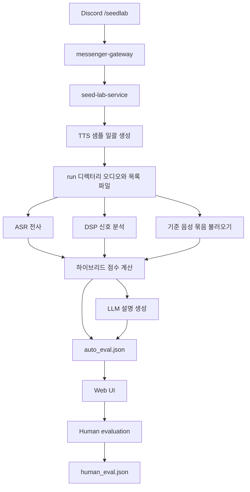
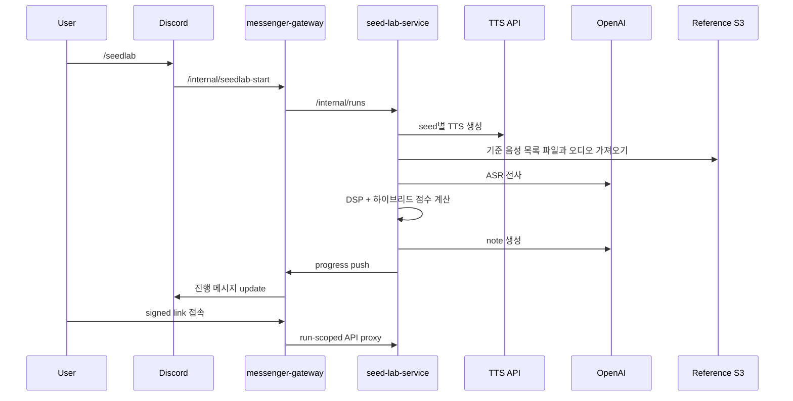
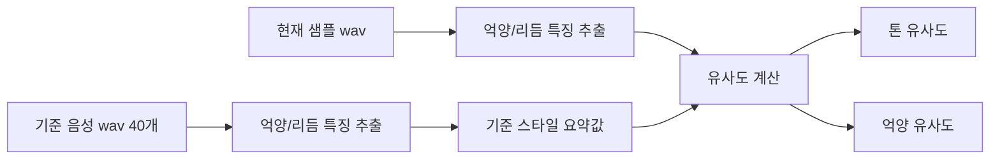

# Seed Lab Evaluation Report

## 목적

Seed Lab은 같은 모델, 같은 파라미터, 같은 대본 조건에서 **seed 차이만으로 발생하는 TTS 품질 편차**를 비교하고, 사람이 최종 선택하기 전에 **자동 평가와 수동 평가를 함께 사용하는 실험 환경**이다.

현재 서버 운영 기준 Seed Lab은 다음 두 가지를 동시에 수행한다.

- seed별 TTS 샘플 대량 생성
- 생성된 샘플의 AI 평가와 사람 평가를 통합한 비교

핵심 목표는 단순한 “발음이 맞는가”가 아니라 아래를 함께 보는 것이다.

- 자연스러움
- 발음 정확도
- 안정성
- 기준 화자 톤 유사도
- 피치 일관성
- 튐/아티팩트 청결도
- 억양 스타일 유사도

중요한 전제는 TTS 평가는 본질적으로 사람 귀에 의한 정성평가 비중이 클 수밖에 없다는 점이다. 자연스러움, 억양, 중간의 미세한 튐, 말끝 처리 같은 항목은 최종적으로 사람이 듣고 판단해야 한다. Seed Lab의 목적은 이 현실을 부정하는 것이 아니라, **AI가 정량평가와 정성평가를 함께 수행해 1차 필터링을 맡도록 만드는 것**이다.

즉 구조는 다음과 같다.

- 정량평가:
  - 음성 전사 기반 발음 정확도(ASR)
  - 길이/속도
  - 피치 급변과 피치 끊김(jump/dropout)
  - 클리핑, 스펙트럼 급등 같은 이상 신호 지표
- 정성평가에 가까운 자동판단:
  - 자연스러움 추정
  - 기준 화자 톤 유사도
  - 억양 스타일 유사도
  - LLM 설명 문장(note)을 통한 품질 설명

이렇게 하면 사람이 30개를 무차별로 처음부터 끝까지 다 듣는 대신,

- 명백히 깨진 샘플
- 기준 스타일과 너무 먼 샘플
- 중간에 심한 튐이 있는 샘플

을 AI가 먼저 제거하고, 사람은 남은 후보에 집중할 수 있다. Seed Lab의 AI 평가는 “최종 심판”이 아니라 **사람 평가를 앞단에서 압축하는 1차 필터**라는 점이 핵심이다.

여기서 중요한 점은, 이번에 추가한 고도화 평가 도구는 분명 **정성평가에 가까운 자동판단**이라는 것이다. `자연스러움`, `톤 유사도`, `억양 유사도`, `중간에 묘하게 튀는 느낌` 같은 항목은 전통적인 정량지표만으로는 다루기 어렵다. 현재 Seed Lab은 패키지 기반 모델과 디지털 신호 처리(DSP) 특징을 결합해 이 영역을 수치화하고 있지만, 이것은 어디까지나 **사람이 실제로 들었을 때의 인상을 근사하는 자동 추정기**이지, 사람 청취를 완전히 대체하는 판정기가 아니다.

## 전체 구조



## 서버 기준 실행 흐름



## 평가 입력

자동 평가는 샘플 1개당 아래 입력을 사용한다.

- 생성된 `wav`
- 기준 대본 `script_text`
- OpenAI ASR 전사 결과
- 선택적 기준 음성 묶음(reference corpus)
  - `SEEDLAB_REFERENCE_AUDIO_LOCAL_PATH`
  - 또는 `SEEDLAB_REFERENCE_AUDIO_S3_URI`

기준 음성 묶음(reference corpus)은 단일 파일이 아니라 **화자 스타일 집합**으로 사용한다. 현재 서버는 S3 목록 파일(`manifest.json`)을 기준으로 기준 음성 40개를 캐시에 저장해서 사용한다.

## 평가 파이프라인

### 1. ASR 전사

OpenAI STT를 사용해 생성 음성을 전사한다. 이 단계의 목적은 “음질 판단”이 아니라 **발음/전사 정확도 측정**이다.

산출 지표:

- `char_accuracy`
- `length_ratio`
- `chars_per_sec`

의미:

- `char_accuracy`
  기준 대본과 ASR 전사의 문자 정합도
- `length_ratio`
  기준 대본 대비 전사 길이 비율
- `chars_per_sec`
  발화 속도를 대략적으로 보여주는 대리 지표(proxy)

### 2. 신호 분석

WAV 자체를 직접 읽어서 프레임 단위로 분석한다. 이 단계는 “AI가 듣는 척하는” 것이 아니라 실제 파형(waveform) 기반 특징값(feature)을 뽑는 단계다.

주요 신호 지표:

- `f0_median_hz`
- `f0_iqr_hz`
- `voiced_ratio`
- `pitch_jump_rate`
- `pitch_dropout_rate`
- `rms_jump_rate`
- `spectral_flux_spike_rate`
- `zcr_spike_rate`
- `clipping_ratio`
- `short_pause_break_rate`
- `energy_cv`
- `pitch_cv`
- `pause_density`
- `voiced_segment_rate`
- `worst_artifact_window_sec`

이 지표들은 각각 아래 문제를 겨냥한다.

- 피치 급변/끊김(jump/dropout): 음정이 갑자기 튀거나 끊기는가
- RMS/스펙트럼/ZCR 급등(spike): 중간에 “툭” 튀는 파열성 이상 신호가 있는가
- 클리핑(clipping): 파형이 포화되어 깨짐이 있는가
- pause/voiced density: 호흡감과 리듬이 비정상적인가

### 3. 기준 음성 묶음(reference corpus) 비교

기준 음성 묶음이 있으면 현재 샘플을 기준 스타일과 비교한다.

구조:



기준 음성에서 계산하는 대표값:

- 평균 피치 중앙값과 퍼짐 정도
- voiced ratio
- energy variation
- pause density
- voiced segment rate
- 파일별 억양/리듬 특징 분포

비교 결과:

- `pitch_profile_similarity`
- `speaker_similarity`
- `intonation_similarity`

## 사용 패키지와 신뢰도

현재 고도화 평가는 여러 패키지를 조합한 하이브리드 구조다.

- `librosa`, `numpy`, `scipy`, `soundfile`
  - 파형(waveform), 기본 주파수(F0), 에너지, 스펙트럼 특성을 직접 계산하는 기반 도구
  - 상대적으로 해석 가능성이 높고, “왜 이 샘플이 튄다고 봤는지”를 설명하기 좋다
- `distillmos`
  - 기준 정답 음성 없이 자연스러움/MOS를 추정하는 모델
  - 사람 청취 점수를 직접 예측하려는 계열이라 정성평가 근사에 유용하지만, 도메인 밖 음성이나 특정 TTS 스타일에선 오차가 날 수 있다
- `speechbrain`
  - 화자 유사도(speaker similarity) 추정
  - 기준 화자와의 톤/화자 유사도 비교엔 유용하지만, 완전한 캐릭터성이나 억양 스타일 전체를 보장하진 않는다
- OpenAI ASR
  - 발음/전사 정확도 측정에는 강하지만, 자연스러움 자체를 직접 평가하는 도구는 아니다
- LLM 설명 문장(note)
  - 설명 생성용
  - 점수의 진실 원천이 아니라, 계산된 지표를 사람이 읽기 쉽게 요약하는 역할이다

정리하면 패키지별 신뢰도는 다음처럼 보는 게 맞다.

- 높은 신뢰:
  - ASR 기반 발음 정확도
  - 클리핑, 순간 튐, 급격한 점프 같은 이상 신호 탐지
- 중간 신뢰:
  - 화자 유사도(speaker similarity)
  - 피치 일관성(pitch consistency)
  - 억양 유사도(intonation similarity)
- 보조 신호:
  - MOS 추정
  - LLM 설명 문장(note)

즉 이 패키지들은 “절대 판정기”가 아니라 서로 다른 관점의 신호를 제공하는 센서에 가깝다. Seed Lab은 그 센서들을 합쳐 **사람 정성평가에 가까운 1차 자동 판정**을 만들고, 마지막 결정은 여전히 사람 청취에 맡긴다.

## 점수 체계

현재 점수는 내부적으로 연속값(raw score) 0~1로 계산하고, UI 표시는 1~5 점수로 바꿔 보여준다.

### 개별 점수

- `naturalness`
  - MOS 추정(`distillmos`) + 속도/길이 안정성 반영
- `pronunciation`
  - `char_accuracy` 중심
- `stability`
  - dropout, RMS 급변, pause anomaly 중심
- `tone_fit`
  - 화자 유사도 + 피치 윤곽 유사도
- `pitch_consistency`
  - 피치 급변/끊김 + 피치 변화량
- `artifact_cleanliness`
  - 클리핑 + 순간 튐 + 에너지 급변
- `intonation_similarity`
  - 기준 음성 묶음 대비 억양/리듬 스타일 유사도

### 최종 평균

최종 AI 평균은 내부 연속값 평균인 `weighted_ai_score_raw`를 기준으로 계산한다.

현재 가중치:

- `naturalness_raw`: 0.20
- `pronunciation_raw`: 0.18
- `stability_raw`: 0.17
- `tone_fit_raw`: 0.15
- `pitch_consistency_raw`: 0.10
- `artifact_cleanliness_raw`: 0.10
- `intonation_similarity_raw`: 0.10

표시용 `weighted_ai_score`는 이 연속값을 1~5 점수로 다시 바꾼 값이다.

## 과락 정책

Seed Lab 자동평가는 단순 평균주의가 아니다. 특정 문제가 있으면 **과락 게이트**가 먼저 작동한다.

### 1. 치명적 아티팩트 과락(`hard_artifact_fail`)

다음 조건을 만족하면 `hard_artifact_fail=true`가 된다.

- `clipping_ratio >= 0.003`
- `rms_jump_rate >= 0.055` and `spectral_flux_spike_rate >= 0.040`
- `pitch_jump_rate >= 0.22` and `pitch_dropout_rate >= 0.45`
- `zcr_spike_rate >= 0.08` and `spectral_flux_spike_rate >= 0.05`

이 경우:

- `artifact_cleanliness_raw` 강한 cap
- `stability_raw` cap
- `rank_excluded=true`

즉 평균이 좋아 보여도 자동 추천 후보에서 제외한다.

### 2. 억양/리듬 과락(`prosody_fail`)

기준 음성 묶음이 있을 때 아래 조건이면 `prosody_fail=true`가 된다.

- `intonation_similarity_raw < 0.28`
- `tone_fit_raw < 0.34`

이 경우도 `rank_excluded=true`로 처리한다.

의미:

- “음질은 깨끗하지만 하리 스타일과 너무 동떨어진 샘플”을 제외

## LLM의 역할

현재 LLM judge는 **점수 생성기**가 아니다.

역할:

- 이미 계산된 지표를 읽고
- 1~2문장 설명 문장(note) 작성

즉 점수의 진실 원천은 다음이다.

- ASR
- 파형 기반 디지털 신호 처리(DSP)
- MOS 추정기
- 화자 검증(speaker verification)
- 기준 음성 묶음 스타일 비교

LLM은 보조 설명기일 뿐이다. 설명 문장(note) 생성이 실패해도 기계 점수는 저장된다.

## 결과 저장 구조

### AI 결과

- `auto_eval.json`
- `auto_eval_live.json`
- `auto_eval_debug.jsonl`

주요 필드:

- `naturalness`
- `pronunciation`
- `stability`
- `tone_fit`
- `pitch_consistency`
- `artifact_cleanliness`
- `intonation_similarity`
- `weighted_ai_score`
- `weighted_ai_score_raw`
- `hard_artifact_fail`
- `hard_artifact_reason`
- `prosody_fail`
- `prosody_fail_reason`
- `rank_excluded`
- `capabilities`
- `reference_set_id`
- `note`(설명 문장)

### 사람 평가

- canonical source: `human_eval.json`

사람 평가는 다음을 포함한다.

- 점수
- 메모
- 선택 여부

## 웹 UI에서 보는 의미

현재 표에서 봐야 하는 기준은 다음과 같다.

- `AI 평균`
  - 전체 균형점
  - 내부 정렬 기준은 `weighted_ai_score_raw`(연속값 평균)
- `AI 피치`
  - 음정 일관성
- `AI 튐`
  - 순간 튐, 클리핑, 급등 신호 위험
- `AI 억양`
  - 기준 음성 묶음 대비 스타일 유사도
- `과락`
  - `hard_artifact_fail` 또는 `prosody_fail`

실전적으로는 아래 순서로 보면 된다.

1. 과락 여부 확인
2. `AI 튐`, `AI 피치`, `AI 억양` 확인
3. `AI 평균`으로 후보 압축
4. 사람 귀로 최종 선택

## 활용 방안

### 1. Seed 후보 압축

30개 전수 청취 전, 자동평가로 아래를 먼저 제거할 수 있다.

- 심하게 튀는 샘플
- 레퍼런스 스타일에서 너무 멀어진 샘플

### 2. 사람 평가 보조

사람은 모든 항목을 일관되게 보지 못한다. 자동평가는 다음 역할에 적합하다.

- 아티팩트 의심 샘플 사전 제거
- 스타일 이탈 샘플 표시
- 청취 우선순위 정렬
- 정량지표와 정성지표를 함께 사용한 1차 필터링

### 3. 지속적 seed 기준선 관리

같은 seed도 대본에 따라 품질이 달라진다. 따라서 “절대 seed 하나”를 찾는 것보다 아래가 현실적이다.

- 레퍼런스 스타일에 가까운 seed pool 유지
- 새 기준 대본으로 주기적 재평가
- 과락 seed 자동 배제

## 한계

현재 구조에도 한계는 있다.

- 기준 음성과 평가 대본이 다르므로 문장 정렬 기반 억양 비교는 아님
- `intonation_similarity`는 스타일 수준(style-level) 유사도이지 문장별 정답 비교가 아님
- MOS 추정기와 화자 모델은 보조 신호이며 절대적 진실은 아님
- 패키지마다 학습 데이터와 가정이 다르므로, 특정 샘플에선 사람 체감과 어긋날 수 있음
- 최종 선택은 여전히 사람 청취가 필요함

즉 Seed Lab AI 평가는 “사람을 대체하는 최종 심사관”이 아니라, **후보를 빠르게 압축하고 위험 샘플을 제거하는 실전용 전처리기**로 보는 것이 맞다.

## 운영 권장 방식

```mermaid
flowchart TD
    A[새 기준 대본 설정] --> B[/seedlab 실행]
    B --> C[30개 샘플 생성]
    C --> D[AI 평가]
    D --> E{과락?}
    E -- Yes --> F[자동 제외]
    E -- No --> G[상위 후보 청취]
    G --> H[사람 점수/메모]
    H --> I[최종 seed 선택]
    I --> J[운영 반영]
```

권장 실무 절차:

1. 기준 대본을 현재 사용 시나리오에 맞게 설정
2. `/seedlab`로 30개 샘플 생성
3. 과락 후보 제거
4. 상위권을 사람 귀로 비교
5. 최종 seed 또는 seed pool을 운영에 반영
6. 대본 스타일이 바뀌면 다시 평가

## 결론

현재 Seed Lab 평가는 단순 ASR 비교를 넘어서, 다음을 결합한 하이브리드 평가기다.

- 전사 기반 발음 정확도
- 파형 기반 아티팩트 / 피치 분석
- MOS 기반 자연스러움 추정
- 기준 음성 묶음 기반 톤 / 억양 비교
- 과락 게이트
- 사람 평가 결합

따라서 가장 적절한 사용 방식은 “AI로 정량/정성 1차 필터링, 사람으로 최종 선택”이다. TTS 평가는 결국 사람 청취가 필요하지만, 그 전에 AI가 위험 샘플과 비유사 샘플을 먼저 걷어내면 비용, 시간, 피로도를 크게 줄일 수 있다. 이 구조가 현재 Seed Lab에서 가장 실용적인 운영 방식이다.

---

이 평가 정확도를 높이면 대본별 seed 자동 선정 기능을 도입할 수 있을 것 같다.
-> 사람의 컨펌 없이 자동화 하기 위한 장치 
